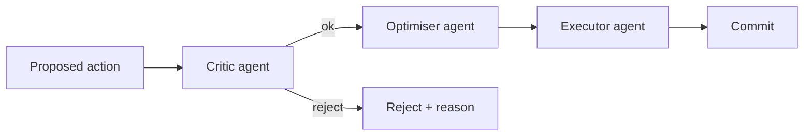

# AGENTIC AUTOMATION — Hermes3D-OS Lite

> How the supervisor daemon, multi-agent loop, and tool registry come
> together to make this an *agentic* print farm OS rather than a
> dashboard with shortcuts.

---

## 1. What "agentic" means here

A non-agentic farm OS is a dashboard: it shows you state and exposes
buttons. The operator decides everything.

Hermes3D-OS Lite is agentic in three concrete ways:

1. **The supervisor daemon watches every printer** and reacts to
   events without operator input — failed prints, stuck spool, drifted
   bed mesh, missed dispatch decisions.
2. **The multi-agent loop reasons about decisions** before they're
   made — Critic checks the proposed dispatch, Optimiser proposes a
   better one if relevant, Executor commits.
3. **The tool registry exposes the kit to LLM agents.** An LLM with
   tool-use access can pick a printer, queue a job, look up a skill,
   estimate a cost — all gated by the same truth gates that protect
   the human surfaces.

When no LLM is reachable, every agentic path falls back to a
deterministic "no-LLM" implementation. The system stays usable.

### USER delegate rule

Hermes Agents are user-authorized operator/admin delegates. When the
user assigns a task, an agent may use the same surfaces and systems the
user authorizes for the work: Hermes3D-OS GUI controls, REST/MCP APIs,
local PC files and installed apps, web services/accounts, VPS or remote
hosts, source checkouts, setup scripts, GitHub branches, commits,
pushes, and pull requests.

That access is not permission to guess. If a source repository is
missing, a credential is not configured, a remote host is unknown, a
model path is missing, a printer state is unclear, or a user preference
is needed, the agent must ask the user or mark the action blocked with
a specific missing-data reason. The GUI must show that blocked or
unavailable state instead of inventing data.

Hermes Agents inherit all hard safety rules:

- Secrets are read only from approved runtime locations and are never
  written into the frontend bundle, logs, proof artifacts, or PR text.
- Printer write actions require the same truth gates, locks, and proof
  records as human-triggered actions.
- FLSUN S1 at `192.168.0.12` remains offline/locked/no-test until the
  user explicitly clears it; agents may edit status metadata but must
  not move, test, upload, or capture against it.
- Source-backed apps must use real upstream source checkouts or report
  the checkout/setup as missing. No drawn slicer, generated file,
  telemetry row, proof event, or remote-host state may be presented as
  real unless the system observed it.

---

## 2. The supervisor daemon

`core.supervisor.daemon.SupervisorDaemon` is a long-running asyncio
loop. It owns:

- A poll cycle (default 30 seconds) that probes every printer.
- An event listener interface — handlers register for events like
  `print_completed`, `print_failed`, `klippy_disconnected`,
  `spool_low`, `mesh_drift_detected`.
- A skill writer — when an event resolves with a clear cause, the
  daemon adds a `failure_pattern` skill to the store.

```python
from hermes3d.core.supervisor.daemon import SupervisorDaemon

daemon = SupervisorDaemon(
    poll_interval_s=30,
    event_handlers={
        "print_failed": [my_failure_handler],
        "spool_low": [my_spool_handler],
    },
)

await daemon.run()  # blocks until cancelled
```

The daemon is started by `scripts/run-dev.{ps1,sh}` and stopped by the
trap on shutdown. Inspect what it did via `var/proofs/supervisor/`.

### Built-in event handlers

- `print_failed` → record in `print_history`, score the failure with
  the failure predictor, log a proof envelope.
- `klippy_disconnected` → mark the printer offline in the dashboard
  cache, retry every 60 seconds with exponential backoff.
- `spool_low` → emit a notification (Discord/Slack/Generic) if the
  notifier is configured.
- `mesh_drift_detected` → suggest a `BED_MESH_CALIBRATE` macro via the
  calibration tool, but do not fire it (calibration auto-fire is a
  v5.2 promotion).

---

## 3. The multi-agent loop

`core.agents.multi_agent.MultiAgentLoop` runs three roles against a
proposed action:



- **Critic** asks: "Is this a safe and correct action given the live
  state of the farm?" Critic has read-only access to truth gates and
  the proof key. Critic can reject.
- **Optimiser** asks: "Given we're going to do this, can we do it
  better?" Optimiser proposes parameter overrides via the skill store.
- **Executor** commits the action and writes the proof envelope.

Each role is implemented as an LLM call when a provider is reachable
(`core.llm.providers.get_default_provider()`), and a deterministic
heuristic when not. The deterministic Critic uses every truth gate;
the deterministic Optimiser looks up best-confidence skills with
matching scope; the deterministic Executor just dispatches.

The loop is invoked by:

- The supervisor daemon (for autonomous failure recovery).
- The CLI when `--review` is passed.
- The Gradio "Multi-Agent Inspector" tab.
- The `/v1/dispatch?review=true` REST query parameter.

---

## 4. The tool registry

`core.agents.tool_registry.ToolRegistry` is a typed dictionary of tools
that LLM agents can call. The 11 built-in tools register at startup
via `register_default_tools()`:

| Tool | Category | Mutates state? |
|------|----------|----------------|
| `fleet_status` | read | no |
| `dispatch` | plan | no |
| `queue_add` | mutate | yes — adds a job to the queue |
| `queue_status` | read | no |
| `spool_list` | read | no |
| `estimate_cost` | compute | no |
| `calibration_macro` | read | no |
| `mesh_analyze` | compute | no |
| `failure_forecast` | compute | no |
| `skill_lookup` | read | no |
| `help` | meta | no |

Mutating tools are still gated by truth gates — `queue_add` won't
accept a job whose mesh hash doesn't match a real file on disk, and
won't enqueue against a printer that isn't material-capable.

### Adding a tool

See `01_requirements/AI_PROGRAMMER_GUIDE.md` §6 for the canonical recipe.

### Calling a tool from Python

```python
from hermes3d.core.agents.tool_registry import tool_registry

result = tool_registry.call("fleet_status")
# result is a dict; tool_registry.manifest() lists every tool's schema
```

### Calling a tool from an LLM via MCP

The MCP server (`api.mcp_server`) exposes the registry as 16 MCP
tools. Connect any MCP-aware LLM client (Claude Desktop, Cursor,
custom) and the tools appear automatically.

---

## 5. The skill memory contract

The brain layer is what turns Hermes3D-OS Lite from "does what I told
it" to "knows what works on my farm."

Every print outcome — success or failure — can become a skill:

- A successful print at 60 mm/s on flsun_t1_a with PETG creates a
  `parameter_override` skill with high confidence.
- A failed print where the cause was "PA-CF on a non-hardened nozzle"
  creates a `failure_pattern` skill.
- A user note like "always slow down for ABS over 4 hours" becomes a
  `user_preference` skill.

Skills are looked up by scope: any combination of
`(printer_id, material, quality_level, hour_of_day)`. The most
specific match wins. Confidence is reinforced on success and weakened
on failure.

### Skill memory in the dispatcher

The dispatcher consults the skill store before scoring. If a
`failure_pattern` skill matches the proposed (printer, material) pair
with confidence ≥0.7, the printer is excluded with a clear reason in
`blockers`.

### Skill memory in the multi-agent loop

The Optimiser uses `parameter_override` skills to propose deltas to
the slicer profile before slicing.

---

## 6. The proof envelope contract

Every action — supervisor decision, multi-agent loop run, dispatch,
calibration intent — emits an HMAC-SHA256 signed proof envelope.

This makes the agentic surface auditable: even if an LLM hallucinated
a justification, the truth gate decisions are recorded honestly.

To inspect every proof envelope:

```bash
bash scripts/proof-collect.sh
cat var/proof-report.json | jq .summary
```

---

## 7. The "no-LLM" fallback

The kit is usable without any LLM provider configured. The default
`OllamaProvider` checks reachability at startup and the system logs
"no LLM reachable; using deterministic heuristics" once.

In that mode:

- The Critic uses truth gates only.
- The Optimiser uses skill memory only.
- The Executor uses the dispatcher only.
- Tool calls work — the registry doesn't need an LLM, only the agent
  *calling* it does.
- Gradio, REST, MCP, and CLI all work normally.

This is a deliberate design choice. A print farm is too important to
depend on a third-party model staying online.

---

## 8. Config knobs

| Setting | Where | Default |
|---------|-------|---------|
| Supervisor poll interval | `config/supervisor.toml` (or env `HERMES3D_POLL_INTERVAL_S`) | 30 |
| LLM provider | `config/llm.toml` (or env `HERMES3D_LLM_PROVIDER`) | `ollama` |
| LLM base URL | env `HERMES3D_LLM_BASE_URL` | `http://127.0.0.1:11434` |
| Multi-agent loop enabled | env `HERMES3D_MULTI_AGENT` | `true` |
| Tool registry exposure | env `HERMES3D_EXPOSE_MCP` | `true` |
| Auto-skill-creation | env `HERMES3D_AUTO_SKILLS` | `true` |

Setting `HERMES3D_MULTI_AGENT=false` reduces the kit to a deterministic
dashboard with the dispatcher and truth gates — useful for debugging
or for environments where LLM calls aren't allowed.

---

## 9. What's deferred

See `00_overview/contract/ROADMAP.md` for the full list. The headline agentic
items:

- v5.2 promotes calibration auto-fire from "suggest only" to "suggest
  and (with consent) fire."
- v5.2 adds a self-improvement loop: the Critic logs its own
  rejection reasons and proposes better truth gates over time.
- v5.3 adds the photo-based first-layer QA loop (Obico is the
  exemplar; the kit's spaghetti detector is its proxy in v5).
