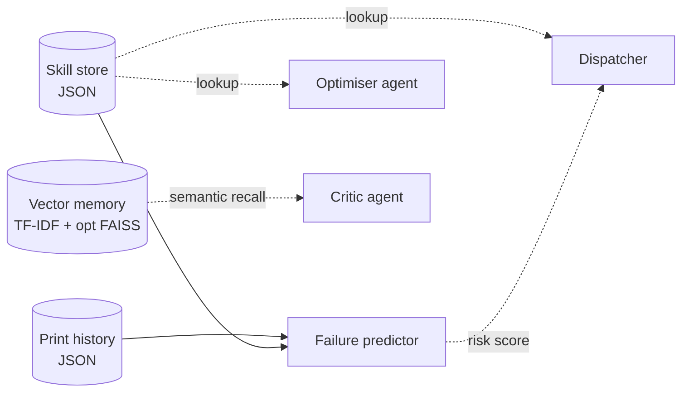

# BRAIN LAYER GUIDE — Hermes3D-OS Lite

> Skill memory, vector memory, failure prediction, and the
> self-improvement loop. The bits that turn the kit into something
> that learns from your farm.

---

## 1. The four brain components



The store is canonical. The vector memory is a semantic index over
skill bodies, notes, and past job rationales. The failure predictor
blends signals from history and skills into a calibrated probability.

---

## 2. Skill store (`core.memory.skill_store`)

### Skill kinds

| Kind | What it captures |
|------|------------------|
| `parameter_override` | "On flsun_t1_a with PETG, set pressure_advance=0.043" |
| `printer_quirk` | "tronxy_d01_pro Z-wobble above 180 mm" |
| `material_quirk` | "PA-CF needs 80°C bed for first layer adhesion" |
| `scheduling_pref` | "Don't run overnight prints on the Sovol — too loud" |
| `user_preference` | "Always quote the price-per-print to the user" |
| `failure_pattern` | "PETG on FLSUN S1 above 250 mm tends to layer-shift" |

### Scope

Every skill has a `SkillScope`:

```python
SkillScope(
    printer_id="flsun_t1_a",     # or None for all printers
    material="PETG",              # or None for all materials
    quality_level="normal",       # or None for any quality
    hour_of_day=None,             # or 0-23 for time-windowed skills
)
```

Lookups use the scope:

```python
skills = store.lookup(
    kind=SkillKind.PARAMETER_OVERRIDE,
    printer_id="flsun_t1_a",
    material="PETG",
    quality_level="normal",
    min_confidence=0.6,
)
```

The `best()` method returns the single highest-confidence skill that
matches.

### Confidence and reinforcement

- New skills start with the confidence the caller provides (defaults
  to 0.5 for derived skills, 0.85 for user-supplied).
- `reinforce(skill_id)` bumps confidence toward 1.0 with a decaying
  step (~+0.05 at conf 0.5, ~+0.01 at conf 0.95).
- `weaken(skill_id)` halves confidence and increments
  `evidence_count`. A skill below confidence 0.2 is not returned by
  default lookups.

### Persistence

Skills live in `var/skills.json` (overridable via
`HERMES3D_SKILLS`). The file is JSON, one record per line on
write, atomically rewritten via `os.replace()` to avoid torn writes.

### Built-in skill packs

The kit ships with three packs under `config/skill_packs/`:

- `flsun_t1_essentials.json` — PA + input shaper + flow ratio for
  both T1 units.
- `tronxy_d01_quirks.json` — Z-wobble warning + bed mesh refresh
  cadence.
- `asa_general_tips.json` — material-level pack for any
  enclosure-capable printer.

Import via the CLI:

```bash
python -m hermes3d.cli skill import config/skill_packs/flsun_t1_essentials.json
```

---

## 3. Vector memory (`core.memory.vector_memory`)

The vector memory is a thin layer over either:

- **TF-IDF** (default, no extra deps). Fast, works on small corpora.
- **FAISS + sentence-transformers** (opt-in, install with
  `pip install faiss-cpu sentence-transformers`). Better semantic
  match on larger corpora.

The memory indexes:

- Every skill's `body` and `notes`.
- Every print history entry's outcome notes.
- Every multi-agent loop rationale.

The Critic agent uses semantic recall during multi-agent runs:

```python
matches = vector_memory.search(
    query="PETG layer shift on tall delta",
    k=5,
)
# returns [(score, document_id, payload), ...]
```

If the FAISS path is enabled, results are typically much more
relevant on queries with synonyms ("shifted layers" matches
"layer_shift", "layer-skip"). The TF-IDF path needs literal token
overlap.

---

## 4. Print history (`core.farm.print_history`)

Append-only JSON ledger of every job that completed (success or
failure). Each entry:

```json
{
  "job_id": "...",
  "printer_id": "flsun_t1_a",
  "material": "PETG",
  "quality_level": "normal",
  "started_unix": 1745000000,
  "duration_hours": 4.5,
  "filament_g": 88,
  "outcome": "success",
  "notes": "...",
  "incident_codes": []
}
```

Aggregation:

```python
from hermes3d.core.farm.print_history import PrintHistory, aggregate_metrics

history = PrintHistory(path="var/print_history.json")
metrics = aggregate_metrics(history.iter_entries(), printer_id="flsun_t1_a")
# {success_rate, avg_duration, total_filament_g, ...}
```

The failure predictor consults this aggregator.

---

## 5. Failure predictor (`core.intelligence.failure_predictor`)

A blender of three signals:

1. **Historical success rate** for the (printer, material) pair, over
   a rolling 50-job window.
2. **Skill memory consultation**: any matching `failure_pattern` skill
   with confidence ≥0.7 inflates the failure probability.
3. **Live state**: a printer reporting a klippy error or stale bed
   mesh inflates the probability further.

The output:

```python
forecast = predict_failure(
    printer_id="flsun_t1_a",
    material="PETG",
    history=PrintHistory(path="var/print_history.json"),
    skills=SkillStore(path="var/skills.json"),
)
# FailureForecast(
#     printer_id="flsun_t1_a",
#     material="PETG",
#     failure_probability=0.18,
#     confidence="medium",
#     citations=["history: 41/50 success", "skill: …"],
#     components={"history": 0.18, "skill": 0.0, "live": 0.0},
# )
```

`confidence` is a categorical based on sample size: `low` (<10 samples
in history), `medium` (10-30), `high` (>30).

---

## 6. Self-improvement loop (v5 scope)

In v5, the loop is conservative:

1. After every print, the supervisor daemon writes a
   `print_completed` event with outcome and notes.
2. If the outcome was `success` and no skill of the same scope
   exists, the daemon does **nothing** — successes don't auto-create
   skills, only failures and explicit user notes do. (This avoids
   reinforcing parameter combinations that "happened to work once.")
3. If the outcome was `failure`, the daemon checks whether a
   `failure_pattern` skill with the same scope exists:
   - If yes, `reinforce(skill_id)`.
   - If no, the daemon writes a candidate skill at confidence 0.5 and
     surfaces it in the Gradio "Skill Memory Browser" tab for the user
     to confirm or reject.

In v5.2, the loop is promoted: candidate skills can be auto-confirmed
after N corroborations, the Critic logs its own rejection reasons,
and the Optimiser proposes parameter deltas based on PA/IS calibration
results.

In v5.3, the loop is closed: the photo-based first-layer QA result
becomes a signal for the predictor and an evidence source for skills.

---

## 7. Where the brain meets the dispatcher

```python
def dispatch(req: DispatchRequest, *, store: SkillStore = None, ...) -> DispatchDecision:
    candidates = []
    for printer in FLEET:
        score = _score_base(printer, req)
        # Skill memory adjustment
        for skill in (store or default_store()).lookup(
            kind=SkillKind.FAILURE_PATTERN,
            printer_id=printer.printer_id,
            material=req.material,
            min_confidence=0.7,
        ):
            score *= 0.1  # severe penalty
            blockers.append(f"failure_pattern: {skill.name}")
        # ... other adjustments
        candidates.append(DispatchScore(printer.printer_id, score, ...))
    return _decide(candidates, ...)
```

The dispatcher *is* a brain consumer. Without the store, it falls back
to the bed-fit + material-capable signal alone.

---

## 8. Inspecting the brain at runtime

CLI:

```bash
hermes3d skill list --printer flsun_t1_a --material PETG
hermes3d skill show <skill_id>
hermes3d skill stats           # confidence histogram
hermes3d history aggregate --printer flsun_t1_a
```

Gradio UI:

- "Skill Memory Browser" tab — search by scope, view by confidence,
  approve candidate skills.
- "Failure Forecast" tab — per-printer-per-material risk score
  with citations.
- "Multi-Agent Inspector" tab — see what the Critic and Optimiser
  considered for the most recent dispatches.

REST:

```
GET /v1/skills?printer_id=flsun_t1_a&material=PETG
GET /v1/skills/{skill_id}
POST /v1/skills/{skill_id}/reinforce
POST /v1/skills/{skill_id}/weaken
GET /v1/forecast?printer_id=flsun_t1_a&material=PETG
```

---

## 9. Privacy and safety

- All brain data is local. Nothing is sent to a third-party service
  without explicit configuration (and the only path that does is the
  optional OpenRouter LLM provider).
- Skill bodies must not contain secrets. The skill-pack importer
  rejects packs containing patterns matching API key heuristics.
- Skill packs are HMAC-signed; tampered packs are rejected.

---

## 10. The brain in pictures

Every brain component has a corresponding diagram under
`02_architecture/diagrams/`:

- `brain_layer.svg` — the four components and their data flow
- `skill_lookup_flow.svg` — scope matching during dispatch
- `failure_predictor.svg` — signal blending

When the diagrams are out of date relative to the code, that's a
contract violation — fix the diagram or fix the code.
