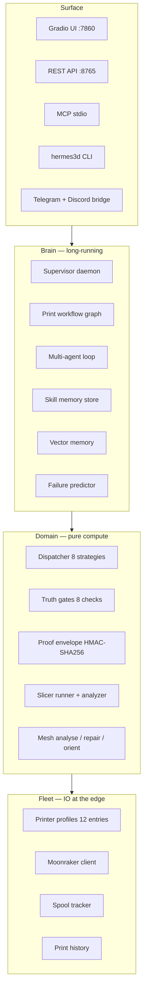
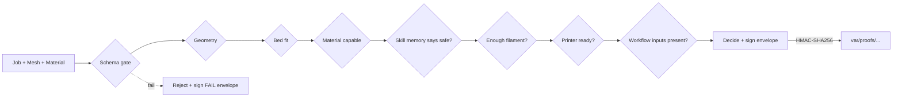
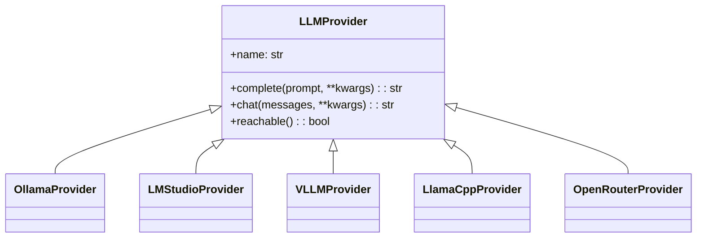
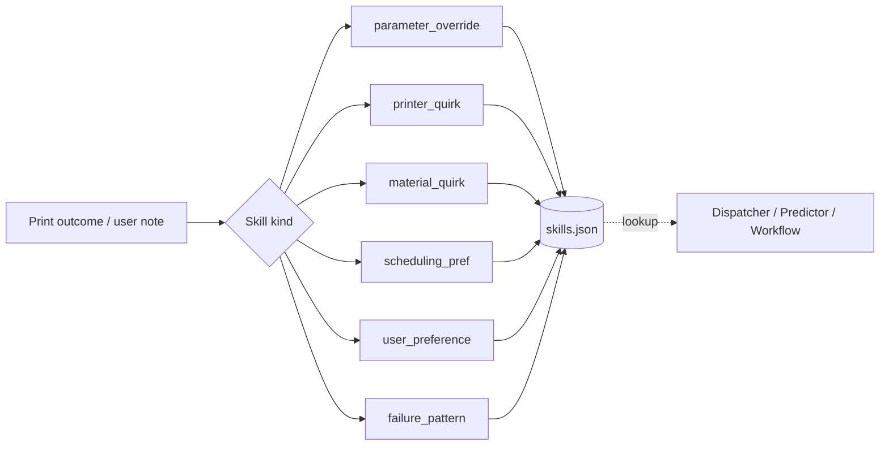

# ARCHITECTURE — Hermes3D-OS Lite

> How the system is put together. Read this after `README.md` and
> before `AI_PROGRAMMER_GUIDE.md`. Diagrams live alongside this file
> in Mermaid and (where useful) under `02_architecture/diagrams/`.

---

## 1. The four layers



The arrows are one-way. The fleet doesn't reach into the brain; the
domain doesn't talk to the surface directly. This keeps imports
acyclic and makes every layer testable in isolation.

---

## 2. Directory map

```
src/hermes3d/
├── api/                  REST + MCP servers (Surface)
├── app/                  Gradio launcher (Surface)
├── cli/                  hermes3d CLI (Surface)
├── core/
│   ├── agents/           dispatcher, mesh tools, multi_agent, tool registry, ...
│   ├── design/           desk organizer (acceptance test subject)
│   ├── farm/             dashboard, spool tracker, cost estimator, history, backup
│   ├── integrations/     OctoPrint, Obico, remote-control, farm discovery
│   ├── intelligence/     failure predictor, self-improvement loop
│   ├── llm/              providers + Ollama client
│   ├── memory/           skill store, skill packs, vector memory
│   ├── modeling/         Blender MCP server (spec)
│   ├── notifications/    Discord/Slack/Generic notifier
│   ├── orchestration/    agent_graph, print_workflow, langgraph_adapter
│   ├── printers/         printer profiles, Moonraker client
│   ├── proof/            HMAC envelopes
│   ├── slicer/           slicer runner, gcode analyzer, profile + postproc gen
│   ├── supervisor/       long-running daemon
│   ├── validation/       truth gates
│   └── visual/           render helpers
└── tests/                264 tests (unit/integration/conformance)
```

---

## 3. Print workflow — the canonical happy path

```mermaid
flowchart LR
    A[1. validate input] --> B[2. analyse mesh]
    B --> C[3. repair mesh]
    C --> D[4. auto-orient]
    D --> E[5. preflight check]
    E --> F[6. dispatch]
    F --> G[7. slice]
    G --> H[8. equivalence check]
    H --> I[9. enqueue]
    I --> J[10. upload to printer]
    J --> K[11. run + monitor]
    K --> L[12. post-print review]

    L -. failure .-> SK[Skill store: failure_pattern]
    L -. success .-> SK
    SK -. inform .-> F
```



Every node:

- Reads its inputs from the workflow state
- Produces a typed output (validated against a schema)
- Emits a checkpoint to `var/workflow/<job_id>/<node>.json`
- Reports PASS / FAIL / SKIP / RETRY

The graph is implemented as a linear executor today
(`core.orchestration.print_workflow`) with a LangGraph source export
available for users who want to run it under LangGraph
(`core.orchestration.langgraph_adapter`).

---

## 4. Truth gates and proof envelopes

This is the system's reason to exist:



See `00_overview/contract/TRUTH_AND_PROOF_SYSTEM.md` for the envelope format
and verification protocol.

---

## 5. Multi-LLM provider abstraction

A single interface (`core.llm.providers.LLMProvider`) is implemented
by five backends. The supervisor and multi-agent loop never care which
one is in use.



When no provider is reachable, the loop falls back to a deterministic
"no-LLM" path — the system stays usable, just less clever.

---

## 6. Skill memory



Skills carry a `confidence` float, an `evidence_count`, and a `scope`
(printer_id, material, quality_level, hour_of_day). Lookups use scope
matching; reinforcement adjusts confidence on every successful or
failed application.

Bundles (`core.memory.skill_pack`) let users export curated sets of
skills — e.g. `flsun_t1_essentials.json` — and re-import them on
another farm.

---

## 7. Surface APIs

| Surface | Where | What |
|---------|-------|------|
| REST | `api.server` (FastAPI) | 10 endpoints: fleet, dispatch, queue, spools, validate, slice, history, skills, proofs, healthz |
| MCP | `api.mcp_server` (stdio) | 16 tools, hand-rolled MCP protocol, no third-party MCP SDK dependency |
| CLI | `cli.__main__` | Subcommands: fleet, validate, dispatch, slice, queue, spool, proof |
| Gradio | `app.launcher` | Multi-tab control panel |
| Bridge | `core.integrations.remote_control` | Telegram + Discord, opt-in, env-credential-only |

---

## 8. Configuration and env

| Variable | Purpose | Default |
|----------|---------|---------|
| `HERMES3D_PROOF_KEY` | HMAC signing key for proof envelopes | `hermes3d-default-proof-key-not-secret` |
| `HERMES3D_QUEUE` | Job queue path | `./var/queue.json` |
| `HERMES3D_SPOOLS` | Spool tracker path | `./var/spools.json` |
| `HERMES3D_SKILLS` | Skill store path | `./var/skills.json` |
| `HERMES3D_PRINT_HISTORY` | History log path | `./var/print_history.json` |
| `HERMES3D_LLM_BASE_URL` | LLM provider URL | `http://127.0.0.1:11434` (Ollama) |
| `HERMES3D_TELEGRAM_BOT_TOKEN` | Telegram bridge token | unset (bridge disabled) |
| `HERMES3D_DISCORD_CONTROL_WEBHOOK` | Discord control webhook | unset |

A complete list lives in `env/.env.example`.

---

## 9. Persistence

All persistent state is JSON, all in `./var/`:

- `var/queue.json` — job queue
- `var/spools.json` — spool inventory + consumption ledger
- `var/skills.json` — skill memory
- `var/print_history.json` — append-only history
- `var/proofs/...` — signed proof envelopes
- `var/workflow/<job_id>/...` — per-job workflow checkpoints
- `var/acceptance-results/...` — acceptance runner outputs
- `var/backups/<utc>/...` — periodic backups (orchestrator in `core.farm.backup`)

This is a deliberate design choice. JSON is greppable, auditable, and
trivially backed up. Switching to SQLite is a v6 conversation, not a v5
one.

---

## 10. Testing topology

```
tests/
├── unit/                 fast, isolated, no IO beyond tmp_path
├── conformance/          schema + protocol contract tests
└── integration/          real persistence, real slicer, real Moonraker (best-effort)
```

The acceptance runner (`04_testing/acceptance/run_acceptance.py`)
is end-to-end: 4 design variants × 12 printers, every cell producing a
signed proof envelope. It runs in <10 seconds on the test machine and
in CI.

---

## 11. Why this shape

A few non-obvious choices, called out so they don't get reversed
without intent:

- **JSON over SQLite at this scale.** A 12-printer farm with one job
  per printer per hour produces fewer than 100 rows a day. SQLite is
  overkill until v6's distributed control plane.
- **Hand-rolled MCP server, not the SDK.** The MCP SDK has heavy
  dependencies and a moving spec. Hand-rolling 16 tools over stdio is
  ~300 lines and matches the rest of the kit's "no surprise
  dependencies" stance.
- **HMAC over digital signatures for proofs.** This is a single-tenant
  farm. Asymmetric crypto adds key-management complexity that doesn't
  pay for itself yet.
- **Linear workflow executor, optional LangGraph.** Most users don't
  need LangGraph. The graph is a state machine with checkpoints —
  that's a 200-line executor, not a framework dependency.
- **Gradio over Electron.** The dashboard is data-heavy and stateful.
  Gradio gets us to a usable control panel in hundreds of lines, not
  thousands.

---

## 12. What's deferred

See `00_overview/contract/ROADMAP.md`. The headline items:

- v5.1 hardens every Tier-2 module to runnable + tested.
- v5.2 turns the multi-agent scaffolding into daily use.
- v5.3 brings the Gradio dashboard to Mainsail-plus parity.
- v6 is speculative: distributed control plane, photo-based first-layer
  QA, NIR material identification.
