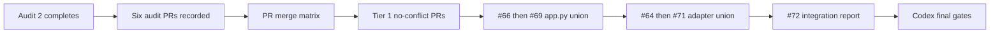
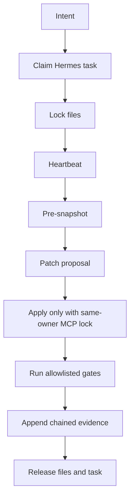
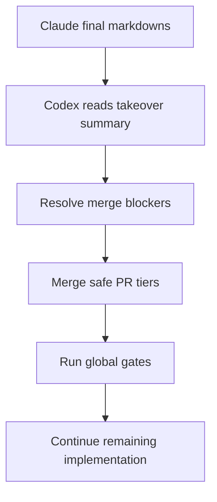

# Claude Final 20-Agent Audit and Codex Takeover Handoff

Updated: 2026-05-06
Owner: codex-master
Target repo: `G:/Github/h3d-gui-wiring-codex`
Remote: `https://github.com/Ghenghis/Hermes3D`

## Why This Exists

Claude usage is expensive and nearly exhausted for the next 3-4 hours. Do not spend the remaining Claude window on new implementation unless a critical audit failure requires a tiny doc-only correction. Claude's final value is to leave Codex a perfect takeover packet:

- finish the in-flight six-agent audit,
- create final markdown summaries and diagrams,
- list every PR, branch, lock, worktree, blocker, and merge-order rule,
- release every Hermes lock Claude owns,
- stop with all useful context saved in GitHub/markdown.

After this handoff, Codex owns remaining implementation.

## Current Known Status

As of this handoff:

- Audit 1 Merge Integrity: PR `#75`, clean.
- Audit 3 Runtime Truth: PR `#74`, clean.
- Audit 4 Printer Safety: PR `#77`, safety verified, zero violations.
- Audit 5 Security/MCP: PR `#76`, clean.
- Audit 6 Docs/Release: PR `#78`, pass with low/medium doc gaps, zero code blockers.
- Audit 2 No-Fake UI: still running. Finish it and open the audit PR.
- Codex code-operator PR: `#73`, draft, branch `codex/hermes-agent-mcp-code-operator`.
- Claude implementation PRs from the 20-lane wave: `#53` through `#72`.

Do not assume this list is still current. Re-check GitHub before writing the final summary.

## Non-Negotiable Final Rules

- No new feature coding in this final Claude run.
- No edits to Codex-owned code-operator files.
- No merging unless the user explicitly asks in this session.
- No deleting worktrees until their branch/PR/status is recorded.
- No fake pass states. If something fails, write the exact failure and owner.
- Every open lock must be released or explicitly marked "still active because..." with owner/task/file.
- S1 `192.168.0.12`: no movement, no upload, no print, no test.
- Secrets stay in `G:/private/.env`; never echo or include values.

## Final Output Files Claude Must Create

Create these markdown files under:

`03_implementation/docs/handoffs/claude-final-audit-2026-05-06/`

1. `00_EXECUTIVE_TAKEOVER_SUMMARY.md`
   - 1-page status for Codex.
   - What is done, what is audited clean, what is still blocked.
   - Exact next command/branch Codex should start from.

2. `01_PR_MERGE_MATRIX.md`
   - Table for PRs `#53-#78` and any final Audit 2 PR.
   - Columns: PR, title, branch, base, mergeability, CI/checks, audit verdict, known conflicts, merge tier, action.
   - Include the confirmed order:
     - Tier 1: no-conflict PRs.
     - Tier 2: `#66` then `#69`, preserving both routers in `api/app.py`.
     - Tier 3: `#64` then `#71`, preserving all voice and printer adapter methods.
     - Tier 4: `#72` final integration report.
     - Audit PRs after their relevant implementation PRs unless they only add docs.

3. `02_OPEN_BLOCKERS_AND_FIX_QUEUE.md`
   - Every blocker/gap found by the six audit agents.
   - Include the docs audit gaps:
     - PR `#53` prose-only file list.
     - PR `#64` non-standard body format.
     - TS7026/TS7006 JSX/type issue absent from ROADMAP if still true.
     - README feature count stale if still true.
   - For each: severity, owner, file/PR, proof, recommended Codex action.

4. `03_LOCKS_WORKTREES_AND_BRANCHES.md`
   - Output of Hermes lock state before and after release.
   - Every Claude worktree path and branch.
   - Every active/released task id.
   - Final proof that no Claude locks remain, or a table of unavoidable active locks.

5. `04_RUNTIME_TRUTH_AND_NO_FAKE_AUDIT.md`
   - Combine Audit 2 and Audit 3 results.
   - List commands used: no-fake scanner, grep patterns, runtime route probes, lint/Playwright where run.
   - Mark every fake/mock/simulated finding as fixed, blocked, or false positive.
   - Include Source OS 60-app runtime truth notes and CLI/verifier status.

6. `05_PRINTER_SAFETY_AND_PHYSICAL_IO_AUDIT.md`
   - Combine Audit 4 results.
   - Prove S1 write paths are blocked.
   - Prove T1/V400 paths are read/probe/policy gated.
   - Include G-code keyword scan result and policy test count.

7. `06_SECURITY_MCP_AND_AGENT_ACCESS_AUDIT.md`
   - Combine Audit 5 and Codex PR `#73` facts.
   - Cover path traversal, secret redaction, shell execution, MCP locks, code-operator action contracts, and evidence chain state.
   - State what Hermes Agents can and cannot safely do after PR `#73`.

8. `07_ARCHITECTURE_AND_FLOW_DIAGRAMS.md`
   - Mermaid diagrams only, no screenshots required.
   - Include:
     - PR merge flow.
     - Hermes Agent code workflow.
     - Source OS runtime verification flow.
     - Printer safety flow.
     - Final Codex takeover flow.

9. `08_FINAL_CLAUDE_RELEASE_NOTE.md`
   - Short note Claude can paste into the chat.
   - Must include: final PR list, final lock state, final blockers, and "Codex can now take over."

## Optional 20-Agent Read-Only Audit Fan-Out

If Claude still has enough budget after finishing Audit 2, run up to 20 read-only agents. They must write findings into the files above, not implement code.

| Agent | Scope | Required Output |
| --- | --- | --- |
| 01 | PR `#53` docs proof | verdict row + doc gaps |
| 02 | PR `#54` app shell | layout/resizable/Simple-Main notes |
| 03 | PR `#55` Playwright | test coverage and missing tab proof |
| 04 | PR `#56` security MCP | security verdict |
| 05 | PR `#57` source gen3d | runtime truth verdict |
| 06 | PR `#58` firmware | no-flash proof verdict |
| 07 | PR `#59` print farm | Moonraker/Klipper probe verdict |
| 08 | PR `#60` modelers | CLI/import proof verdict |
| 09 | PR `#61` artifacts/proof | artifact/path traversal verdict |
| 10 | PR `#62` learning/autopilot | idle work truth verdict |
| 11 | PR `#63` slicers | slicer CLI proof verdict |
| 12 | PR `#64` voice | Azure/backend secret safety verdict |
| 13 | PR `#65` design | real CAD/provider checks verdict |
| 14 | PR `#66` source UI | UI cutoff/readability verdict |
| 15 | PR `#67` observe | camera refresh/S1 rotation verdict |
| 16 | PR `#68` jobs | policy-gated transitions verdict |
| 17 | PR `#69` settings/plugins | update/rollback truth verdict |
| 18 | PR `#70` gen3d | provider readiness/template verdict |
| 19 | PR `#71` printers | onboarding/S1 lock verdict |
| 20 | PR `#72` final integrator | merge matrix and integration truth |

Each agent must answer:

- PASS/BLOCKED/NEEDS-CODEX-FIX.
- Evidence commands or PR proof used.
- Files/PRs touched: should be none except markdown aggregation.
- Exact Codex next action if not PASS.

## Required Final Commands

Run these before finalizing the handoff:

```powershell
gh pr list --repo Ghenghis/Hermes3D --state open --limit 80 --json number,title,headRefName,baseRefName,isDraft,mergeStateStatus,statusCheckRollup
Invoke-RestMethod http://127.0.0.1:8765/api/code-operator/mcp-locks/state | ConvertTo-Json -Depth 8
python 03_implementation/scripts/scan_active_ui_no_fake.py
```

If the API server is not available, record that honestly and use the MCP tool state directly.

## Mermaid Diagrams To Include

### Merge Flow



### Hermes Agent Code Flow



### Codex Takeover Flow



## Final Stop Condition For Claude

Claude is done when:

- Audit 2 is finished and pushed as a PR.
- Files `00` through `08` above exist and are pushed.
- All audit PRs are listed with verdicts.
- All Claude-owned locks are released or explicitly explained.
- The final chat message says exactly what Codex should do next.

Then stop using Claude until the user explicitly resumes it.
