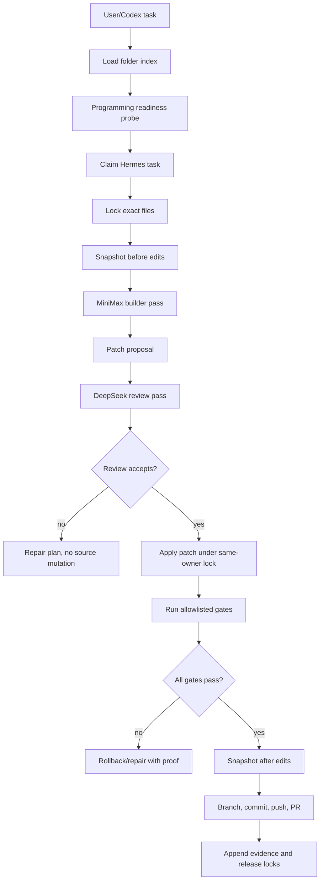

# Hermes Agent E2E Truth/Proof Plan

Updated: 2026-05-08  
Owner: codex-master  
Task: H3D-CODEX-HERMES-AGENT-E2E-ROADMAP  
Status: Active P0

## Purpose

Hermes Agents are not complete when the chat rail renders, a provider key exists, or a planning artifact is written. For Hermes3D OS, "Hermes Agents work" means the agents can help complete the project alongside Codex and the user:

1. load the Hermes3D folder index and source context,
2. receive a real task,
3. claim and lock the correct files through `hermes3d-locks`,
4. create pre-change snapshots,
5. use MiniMax and DeepSeek provider teams for build/review,
6. propose and apply a bounded patch,
7. run proof gates,
8. create a branch, commit, push, and PR,
9. leave rollback/diff proof for every file touched,
10. release locks and evidence.

Until that chain passes on a real Hermes3D task, the agent system is `IN_PROGRESS`, not done.

## Required Agent Context

Every coding task starts with the folder index created for agents:

- `03_implementation/docs/handoffs/hermes3d-os-folder-index-2026-05-07/00_INDEX.md`
- `03_implementation/docs/handoffs/hermes3d-os-folder-index-2026-05-07/01_TAXONOMY.md`
- `03_implementation/docs/handoffs/hermes3d-os-folder-index-2026-05-07/02_EXCLUSIONS.md`
- the relevant per-folder/category docs under `03_implementation/docs/handoffs/hermes3d-os-folder-index-2026-05-07/`
- this contract, `03_implementation/docs/handoffs/HERMES_AGENT_E2E_TRUTH_PROOF_PLAN_2026-05-08.md`

Acceptance:

- The task record names which index files were used.
- The selected files must match the folder ownership/context in the index.
- If the folder index is missing or stale, the agent must stop and request a refresh instead of guessing.

## Two-Agent Team Contract

| Team | Provider | Role | Required proof |
| --- | --- | --- | --- |
| Team A | MiniMax | Builder | Reads folder index, creates implementation plan and patch proposal artifact. |
| Team B | DeepSeek V4 | Reviewer | Reviews Team A artifact, file scope, proof ids, safety risks, and gate results. |
| Local fallback | LM Studio/Ollama | Backup reviewer or offline assistant | May assist only when explicitly marked fallback; cannot replace MiniMax/DeepSeek proof when those keys are configured. |

Provider keys stay in `G:/private/.env` only. The UI and proof files may name env keys and provider ids, never secret values.

Current live-smoke result for this branch:

- Folder-index context and MCP locks are now ready.
- OpenHands/OpenCode CLI runners are detection-only and currently report no local PATH executable.
- MiniMax execution is currently blocked by live HTTP 401 from the configured endpoint/key; the route records this as a redacted blocked reason instead of crashing or claiming the provider is usable.
- DeepSeek execution is also currently blocked by live HTTP 401 from the configured private key.
- Until MiniMax and DeepSeek auth are corrected in `G:/private/.env`, the workbench can prove readiness/context and run blocked-provider smoke proofs, but cannot complete the two-provider build/review pass.

Shared provider rule:

- Hermes Agent, OpenHands CLI, and OpenCode CLI may all use the user's MiniMax and DeepSeek API keys.
- They must use those keys through Hermes3D backend provider adapters or sandbox-injected private env only.
- Provider secrets must never appear in frontend bundles, CLI command arguments, proof artifacts, logs, markdown, screenshots, PR bodies, or GitHub Actions output.
- MiniMax remains the default builder lane and DeepSeek V4 remains the default reviewer lane unless the user changes provider policy.
- If either provider is not configured or fails health checks, the task is blocked or downgraded to explicitly marked local fallback; it is not marked complete.

## OpenCode Hermes Multi-Agent Pattern

`https://github.com/1ilkhamov/opencode-hermes-multiagent` is useful as a role/pipeline reference only, not as a replacement for Hermes3D's runtime and not as a dependency to import wholesale. It documents a 17-agent OpenCode layout with a master orchestrator, research, planning, implementation, quality, documentation, and infrastructure roles. Hermes3D should extract only the useful role taxonomy and mandatory quality chains, then enforce them through Hermes3D's own locks/proof stack.

Patterns to use:

- Finder/scout first for every code task.
- Architect/planner before multi-file implementation.
- Coder/editor/fixer/refactorer roles separated by intent.
- Reviewer and tester mandatory after any code change.
- Security reviewer mandatory for auth, secrets, permissions, user data, external API keys, shell/process execution, file-system mutation, printer/network actions, and MCP/tooling changes.
- DevOps/optimizer roles for CI, sandbox, performance, and process-supervisor work.

Patterns not to copy blindly:

- Raw write/edit/bash tool access. Hermes3D agents must write only through snapshot, patch proposal, same-owner MCP file lock, allowlisted gate, and restore/rollback flows.
- Provider/model names. Hermes3D's active coding teams are MiniMax builders and DeepSeek V4 reviewers from private env, with local fallback only when explicitly marked fallback.
- OpenCode-specific config as a runtime dependency. Hermes3D should keep its own API/action catalog and use this repo as a skill/role seed.
- Any extra agent role that does not map to a real Hermes3D action, proof gate, or user-visible workflow. Useful patterns only; no bloat.

Required Hermes3D adaptation:

- Add role names to agent task records: finder, analyst, architect, planner, builder, reviewer, tester, security, documenter, devops, optimizer.
- Make `finder -> builder -> reviewer -> tester` the minimum coding chain.
- Make `finder -> analyst -> architect -> planner -> builder -> reviewer -> security -> tester` mandatory for high-risk coding tasks.
- Record which roles ran, which provider/team handled them, and which evidence/proof ids they produced.

## OpenHands Patterns To Use

OpenHands is useful for Hermes3D as a sandbox and action/observation reference. Use only the pieces that close the Hermes Agent coding gap:

- Docker sandbox pattern: run coding tasks in an isolated container by default, with the Hermes3D worktree mounted as the workspace only when the task has an approved scope.
- Custom image pattern: prebuild a Hermes3D agent image with Python, Node, Playwright browsers, Rust toolchain, `gh`, git, and the exact project gate dependencies so agents do not spend every task reinstalling tools.
- Runtime action boundary: all agent commands, file reads/writes, browser actions, and environment operations pass through a single runtime executor that returns observations and proof metadata.
- AgentSkills/microagent pattern: store small on-demand Hermes3D skills for Source OS runners, printer safety, UI no-fake checks, provider coding, evidence, and PR shipping instead of bloating the base prompt.
- Remote agent-server pattern: allow the UI/API to talk to a sandboxed agent worker over HTTP, but keep Hermes locks, provider secrets, and PR approval policy in Hermes3D backend control.

Patterns not to copy:

- Direct host local runtime for write tasks. It is fast, but Hermes3D write tasks should default to container isolation first and use host access only for explicitly approved local-device work.
- Read-write repo mount without Hermes file locks. The sandbox protects the host, but it does not replace MCP ownership coordination.
- Arbitrary terminal execution from chat. Hermes3D keeps an allowlisted gate runner first.

OpenHands acceptance for Hermes3D:

- A sandbox readiness API reports Docker availability, image tag, mounted workspace, denied host paths, network mode, and allowed command families.
- Agent coding tasks run inside that sandbox unless they are read-only or explicitly local-device scoped.
- Sandbox outputs are attached to the same evidence chain as Hermes locks, snapshots, gates, and PRs.

## Compatibility Gaps Before OpenHands/OpenCode-Style Use

Hermes3D already has provider-team readiness, MCP locks, snapshots, patch proposal/apply APIs, gate APIs, and git/PR lanes. These pieces are not enough for OpenHands/OpenCode-style daily use until the following adapters exist:

| Missing adapter | Why it matters | Done proof |
| --- | --- | --- |
| Sandbox worker adapter | OpenHands-style coding needs isolated execution, not host shell access from chat. | `/api/code-operator/sandbox/readiness` reports Docker/process/remote availability, image, workspace mount, denied paths, network mode, and allowed command families. |
| Agent action/observation envelope | OpenHands-style tools return observations after actions; Hermes3D needs a common envelope for file, terminal, browser, and proof results. | Every code-operator action returns action id, observation summary, artifact/proof ids, and blocked reason when denied. |
| Role-chain registry | OpenCode-style multiagent work needs primary/subagent roles, but Hermes3D must enforce roles through proof. | Task records list finder, builder, reviewer, tester, security roles with provider/team and evidence ids. |
| Hermes skill pack | Agents need reusable project-specific skills rather than huge prompts. | Source OS runner, printer safety, no-fake UI, code patch, evidence, PR shipping, and rollback skills exist and are referenced by task records. |
| Folder-index boot loader | Agents must know the repo layout before editing. | DONE for planning/review: the E2E route loads the PR #86 folder index path, sends selected index docs as provider file context, and records loaded docs plus target ownership path. |
| Provider execution loop | MiniMax and DeepSeek currently create artifacts only after live auth succeeds, and provider auth cannot be assumed from env presence. | PARTIAL: `/api/code-operator/providers/smoke` proves MiniMax/DeepSeek live auth through the same bounded chat path used by coding/review passes, records MCP evidence, and returns redacted HTTP/auth blockers. `/api/code-operator/e2e/jobs` links readiness -> folder-index context -> assignment -> locks -> pre-snapshots -> MiniMax coding artifact -> DeepSeek review artifact -> evidence/release, but live private keys must pass before this closes. |
| Runtime freshness guard | The browser can outlive a backend process and keep calling stale routes from an older branch. | DONE: `/api/system/runtime-identity` reports backend source path, branch, commit, pid, required Agent Workbench routes, and missing-route list. The Agents tab shows this as Runtime freshness so stale-code 404s are visible and actionable. |
| UI Agent Code Workbench | The user needs to launch and inspect the agent workflow from Hermes3D OS, not through Codex hidden execution. | PARTIAL: Agents tab has the workbench form, readiness proof, provider smoke buttons, CLI runner preflight state, provider artifact result view, and reviewed patch -> gate -> branch/stage/commit/push/PR controls. Source mutation still fails closed unless proposal, review proof, same-owner MCP lock, snapshots, gates, and git policy are all satisfied. |
| Policy bridge | OpenHands/OpenCode patterns can run powerful tools; Hermes3D must apply printer, secret, and path policy first. | S1/printer actions, secrets, destructive git, env writes, and denied paths fail closed before sandbox/provider execution. |

No adapter is considered complete without a route probe, test, proof event, and visible UI state or explicit blocked reason.

## CLI Runner Permission

Hermes Agents may use OpenHands and OpenCode through CLI when that is the right tool for a coding task, but never as an unmanaged shell escape.

Allowed CLI pattern:

- Register `openhands` and `opencode` as Source OS / code-operator CLI runners.
- Detect executable path and version with non-mutating commands only.
- Run them inside the sandbox worker by default.
- Scope `cwd`, allowed files, network mode, and env names per task.
- Require `hermes_claim_task` and `hermes_lock_files` before any write-capable run.
- Snapshot every file that a CLI worker may edit before invocation.
- Capture stdout/stderr/artifacts into proof records with secret redaction.
- Run DeepSeek review and fixed gates before staging or pushing changes.
- Release files/task and write rollback proof at the end.

Blocked CLI pattern:

- No raw user-entered OpenHands/OpenCode command strings from chat.
- No host write access for OpenHands/OpenCode unless the task is approved and file-locked.
- No secret values passed to CLI args; secrets stay in backend/private env and are redacted in logs.
- No printer/network automation through these CLIs until the task has explicit printer policy approval.

Acceptance for CLI usability:

- `/api/code-operator/cli-runners` lists OpenHands/OpenCode detection, version, source path, sandbox support, and blocked reasons.
- `/api/code-operator/cli-runners/{runner_id}/preflight` proves the CLI can start in read-only/safe mode.
- `/api/code-operator/cli-runners/{runner_id}/run` refuses execution unless locks, snapshots, sandbox, allowed task type, and output proof are all configured.

## E2E Coding Loop

## Required Gates Before A PR

Minimum gates for a code task:

- `git diff --check`
- relevant Python compile or unit tests for backend changes
- relevant TypeScript/lint/build gate for UI changes
- `python 03_implementation/scripts/scan_active_ui_no_fake.py` for UI changes
- Playwright focused proof for changed UI tabs
- security/path/secret scan for route, command, provider, or file-system changes
- DeepSeek review artifact tied to the same proof ids

No PR is accepted from an agent if any required gate is skipped, timed out without being recorded, or fails.

## Current Missing Pieces

| Gap | Why it blocks "working agents" | Required completion |
| --- | --- | --- |
| Patch proposal/apply is not yet chained from provider artifact | The workbench now gets to reviewed provider artifacts, but it deliberately stops before source mutation. | Add reviewed patch extraction, same-owner lock validation, apply, post-snapshot, gate runner, git branch/stage/commit/push/PR, and rollback proof controls. |
| Private provider auth is rejected live | MiniMax and DeepSeek env keys exist but both live provider smoke calls return HTTP 401. | Replace the rejected MiniMax/DeepSeek keys in `G:/private/.env`, then rerun `/api/code-operator/providers/smoke` for both providers before trying the first co-developer task. |
| OpenHands/OpenCode are detection-only | CLI worker rows are visible but cannot run write tasks safely yet. | Add sandbox readiness, read-only preflight route, task-scoped env/cwd/files, output proof capture, and keep write runs blocked until every gate is present. |
| No real co-developer smoke task has passed | There is route smoke for individual pieces, but no full task completed by both agent teams. | Run a small docs or UI patch task through MiniMax + DeepSeek + locks + gates + PR and record proof ids. |
| Source app runner gaps distract from agent runtime P0 | Runner gaps are useful but secondary while agents cannot co-develop. | Keep runner work queued; prioritize the agent coding loop until it can help complete the runner gaps itself. |

## Working Order From Here

This is the next implementation sequence. Do not resume manual Source OS runner-gap slices until this passes.

1. Provider truth:
   - Probe MiniMax and DeepSeek readiness from `G:/private/.env`.
   - Prove both providers are visible only through backend/private env.
   - DONE for route/UI truth: `/api/code-operator/providers/smoke` and the Agents-tab provider smoke buttons return pass or redacted HTTP/auth blockers and append MCP evidence.
   - CURRENT BLOCKER: both configured provider keys are rejected live with HTTP 401; replace keys in `G:/private/.env` and rerun smoke before E2E execution.
2. Agent Code Workbench:
   - DONE for planning/review: add a visible Agents-tab workbench for coding tasks.
   - Inputs: title, objective, file list, target branch, role chain, provider policy, and optional OpenHands/OpenCode CLI worker preference.
   - Current output: task id, loaded folder-index docs, provider artifacts, snapshots, evidence, and next-required-step list.
   - DONE for manual ship controls: reviewed patch apply, gate run, branch, stage, commit, push, and PR buttons are visible in the workbench and call the code-operator APIs.
   - Remaining output: one automatic closed E2E task that produces gates, branch, PR URL, rollback ids, and provider artifacts after private auth passes.
3. E2E orchestration route:
   - PARTIAL: one route coordinates folder-index context, assignment, locks, snapshots, MiniMax pass, DeepSeek pass, evidence, and release.
   - Remaining: patch proposal, apply, gates, git lane, and rollback proof.
   - Route fails closed at the first missing prerequisite.
4. OpenHands/OpenCode CLI adapters:
   - Add detection/preflight routes first.
   - Keep write-capable CLI runs blocked until sandbox readiness exists.
   - Share MiniMax/DeepSeek provider pool through backend/private env only.
5. First real smoke:
   - Use a low-risk Hermes3D file.
   - Require both provider artifacts, same-owner MCP locks, pre/post snapshots, gate pass, DeepSeek review, branch, PR, and release evidence.
6. Resume 60-app work:
   - Agents use the proven workflow to close runner gaps and app setup gaps with proof.

## First Proof Task

Use a low-risk Hermes3D task that still exercises real code:

- target: one small roadmap/UI label or test fixture file,
- scope: one or two files only,
- owner: `hermes-agent-e2e-smoke`,
- providers: MiniMax builder, DeepSeek reviewer,
- gates: diff-check, no-fake scan, targeted unit or Playwright where applicable,
- output: branch + PR with rollback snapshots.

The task is not accepted as a "pass" unless both provider artifacts, file snapshots, MCP lock evidence, gate evidence, and PR URL exist.

## Relationship To The 60 Source Apps

The 60 Source OS apps are still required, but they are downstream of the agent runtime:

- Agents should use the runner contract matrix to find missing setup/install/runtime gaps.
- Agents may prepare setup plans and PRs for app runners.
- Agents may not mark an app done until source, install/setup, runtime runner, health/version proof, update/rollback proof, and agent action proof exist.
- Service/web apps need real local/private URLs and post-start health proof.
- CLI apps need executable/import/package proof and a safe runner.

The goal is for MiniMax + DeepSeek Hermes teams to help close those 60 rows, not for Codex to keep closing them manually while the agent runtime remains partial.
