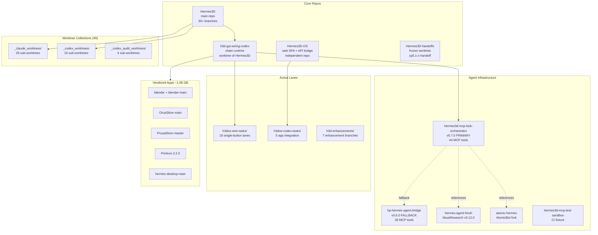
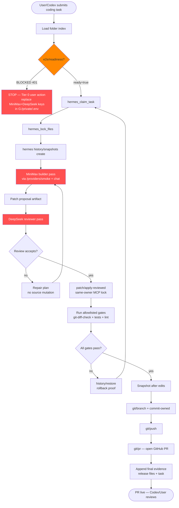
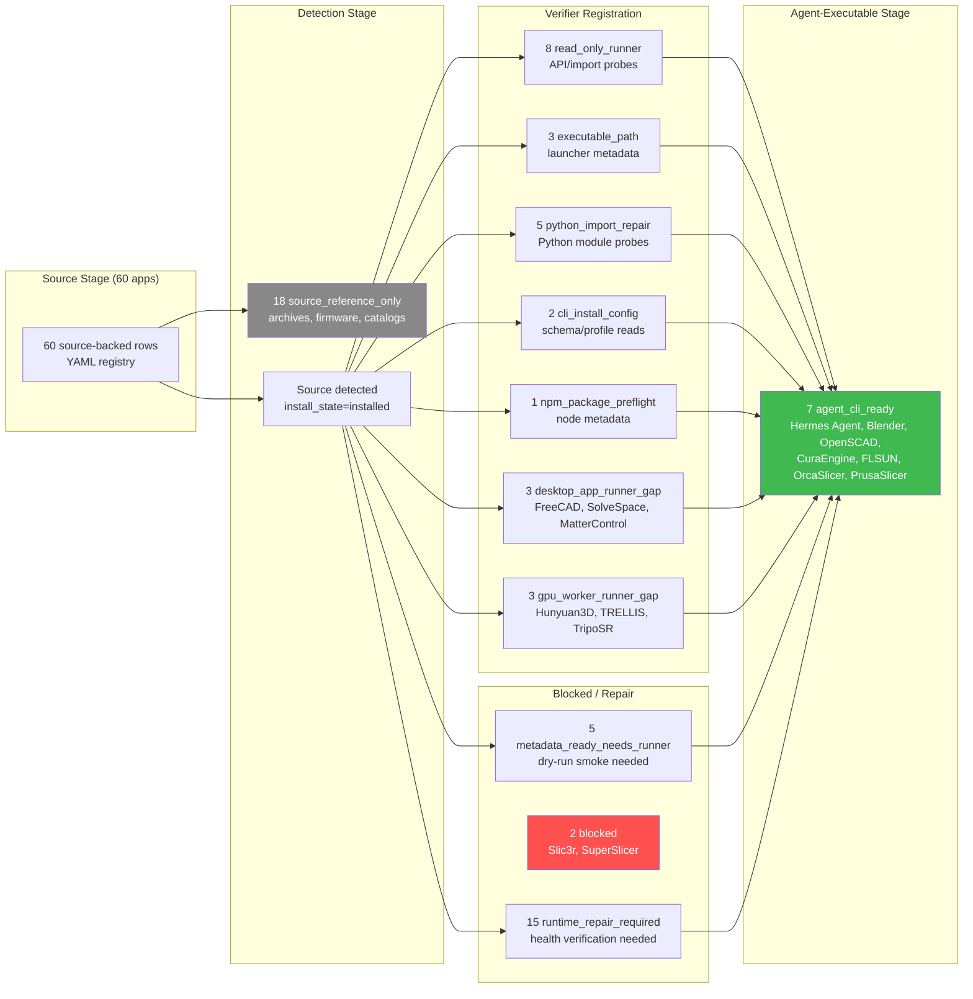
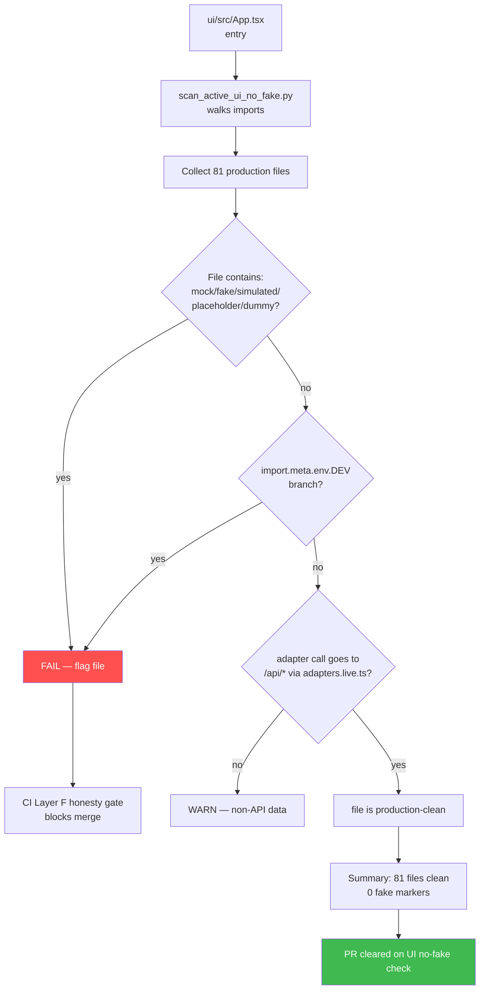
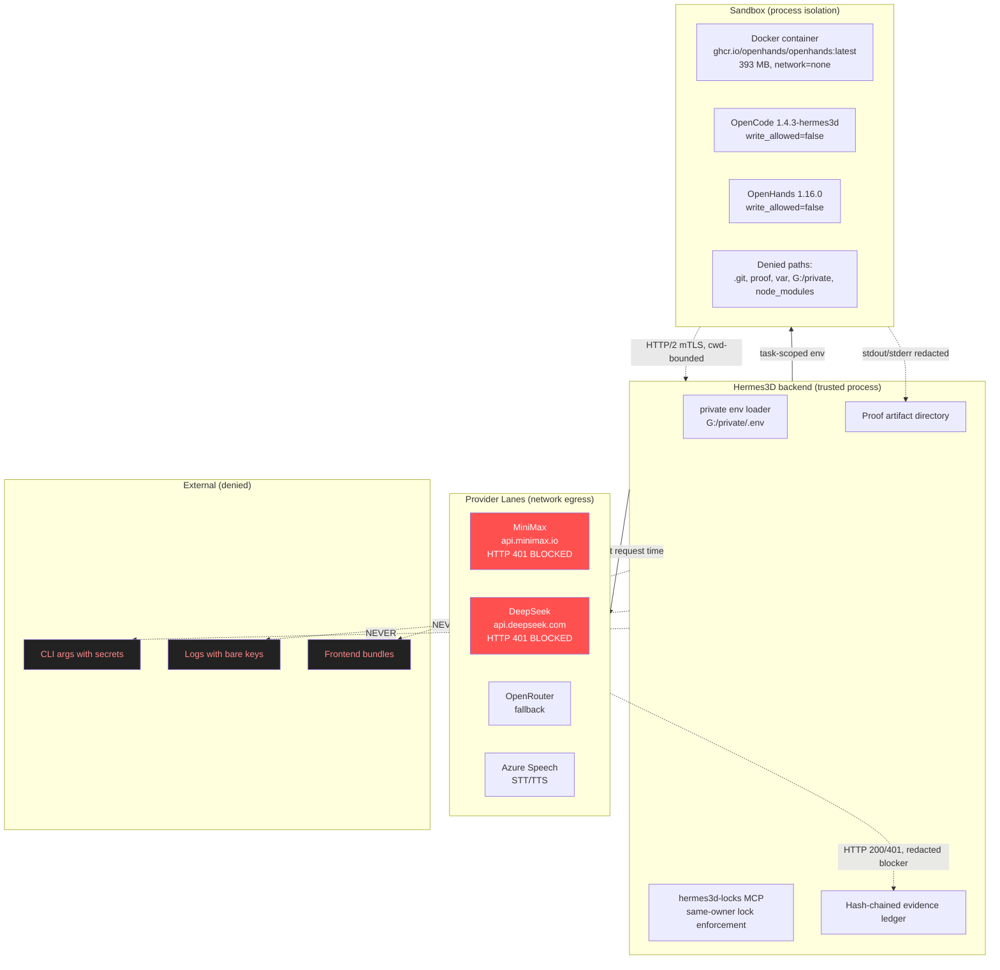

# 10 — Diagrams

Mermaid-only. The 6 required diagrams from the PR 104 contract.

---

## 1. GitHub Folder / Worktree Topology



---

## 2. Hermes Agent E2E Coding Loop



> **Current blocker is at MINIMAX/DEEPSEEK** (red nodes) — both providers return HTTP 401 from configured keys. All other steps are wired and ready.

---

## 3. Source OS 60-App Runtime Ladder



---

## 4. UI No-Fake Verification Flow



---

## 5. Provider / Sandbox / CLI Trust Boundary



---

## 6. Codex Takeover Queue

```mermaid
gantt
    title Codex Takeover Queue (after Tier 0 user action)
    dateFormat YYYY-MM-DD
    axisFormat %m-%d

    section Tier 0 BLOCKER
    User: replace API keys+restart      :crit, t0, 2026-05-08, 1d

    section Tier 1 Agent loop e2e
    Pick smallest reversible target     :t1a, after t0, 1d
    First MiniMax+DeepSeek loop         :crit, t1b, after t1a, 1d
    Patch apply + gates + PR            :t1c, after t1b, 1d
    Rollback drill                      :t1d, after t1c, 1d
    First-loop proof JSON               :t1e, after t1d, 1d

    section Tier 2 Runner gaps
    MeshLab CLI                         :t2a, after t1e, 1d
    Slic3r/Strec3D/SuperSlicer          :t2b, after t2a, 1d
    FreeCAD/SolveSpace/MatterControl    :t2c, after t2b, 2d
    GPU dependency verifiers            :t2d, after t2c, 2d
    npm metadata + python imports       :t2e, after t2d, 2d
    Service+web health 9 modules        :t2f, after t2e, 3d

    section Tier 3 Update Center
    Orchestrator scaffold               :t3a, after t2f, 2d
    SmokeGate adapters                  :t3b, after t3a, 3d
    Self-update lane                    :t3c, after t3b, 2d
    Release watch                       :t3d, after t3c, 2d
    Approval policy                     :t3e, after t3d, 1d
    UI density polish                   :t3f, after t3e, 2d

    section Tier 4 Action catalog
    Audit script                        :t4a, after t1e, 1d
    Source/Settings/Plugins rows        :t4b, after t4a, 2d
    Autopilot/Voice/Design/Gen3D rows   :t4c, after t4b, 2d
    Per-row safety/approval/proof fields:t4d, after t4c, 1d
    CI parity gate                      :t4e, after t4d, 1d
```

---

## Appendix: Diagram Notes

- All diagrams reference live state at 2026-05-08 17:30Z from `http://127.0.0.1:8765`.
- Red nodes indicate current blockers (provider HTTP 401, blocked slicers, denied secret paths).
- Green nodes indicate operational/ready surfaces (CLI-ready apps, PR loop endpoints).
- Gray nodes indicate reference-only (no runner needed) or excluded paths.
- The Codex queue Gantt is illustrative — actual durations depend on Tier 0 unblock timing and provider stability.
