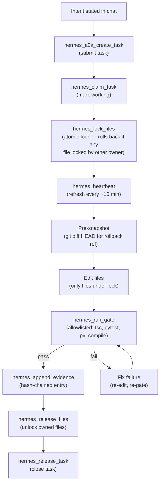
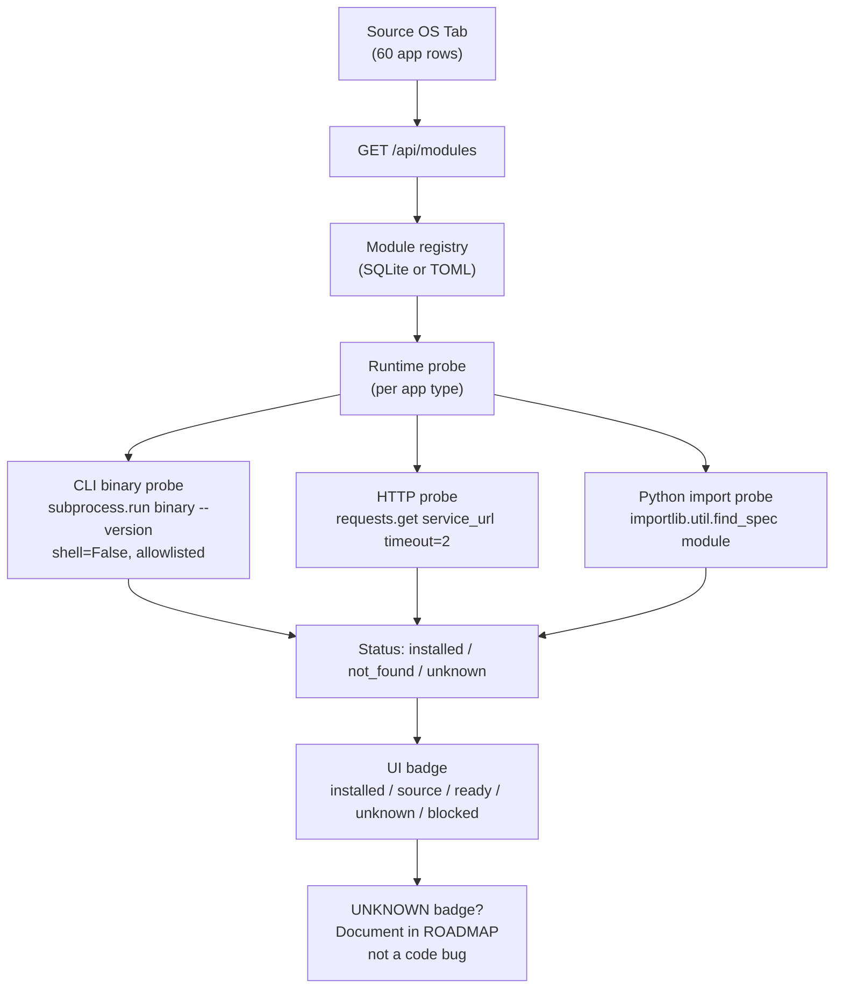
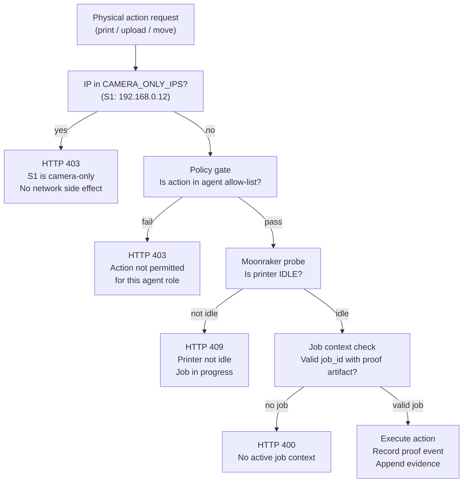
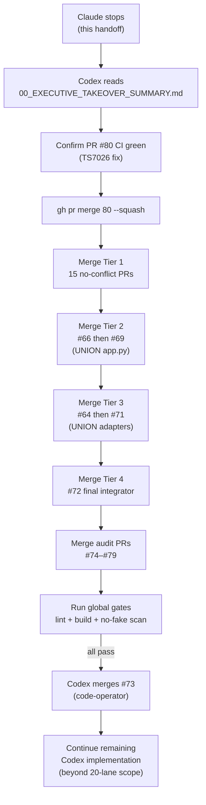
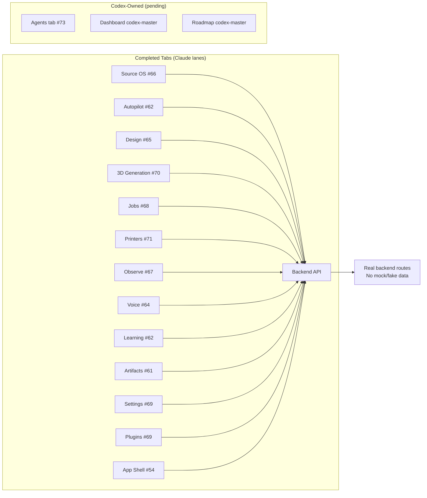

# Architecture and Flow Diagrams

Generated: 2026-05-07T01:03 UTC

---

## PR Merge Flow

```mermaid
flowchart LR
  A["Step 0: PR #80\nTS7026 CI fix"] --> B["Tier 1\n#53 #54 #55 #56 #57\n#58 #59 #60 #61 #62\n#63 #65 #67 #68 #70"]
  B --> C["Tier 2\n#66 first\n(source-ui app.py router)"]
  C --> D["#69 second\n(settings router — UNION\nkeep both routers)"]
  D --> E["Tier 3\n#64 first\n(voice adapters)"]
  E --> F["#71 second\n(printers adapters — UNION\nkeep all methods)"]
  F --> G["Tier 4\n#72 final integrator"]
  G --> H["Audit PRs\n#74 #75 #76 #77 #78 #79"]
  H --> I["Global gates\nnpm run lint\npy_compile\nscan_active_ui_no_fake.py"]
  I --> J["Codex continues\nremaining implementation\n(#73 code-operator + beyond)"]
```

---

## Hermes Agent Code Workflow (MCP Lock Protocol)

**No source changes without an active same-owner lock. No locks held after work is done.**

---

## Source OS Runtime Verification Flow

---

## Printer Safety Decision Flow

---

## Codex Takeover Flow

---

## Hermes3D OS Tab Wiring Summary

