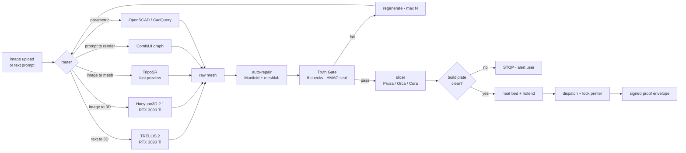
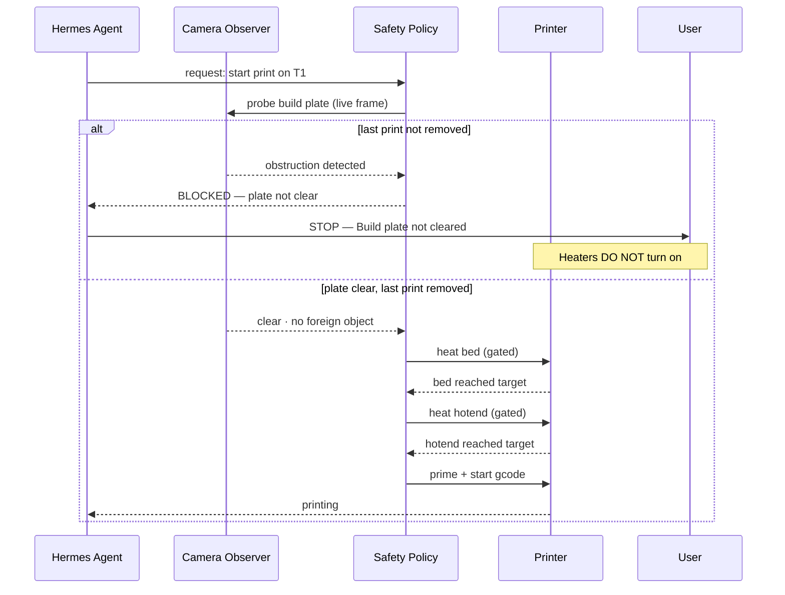
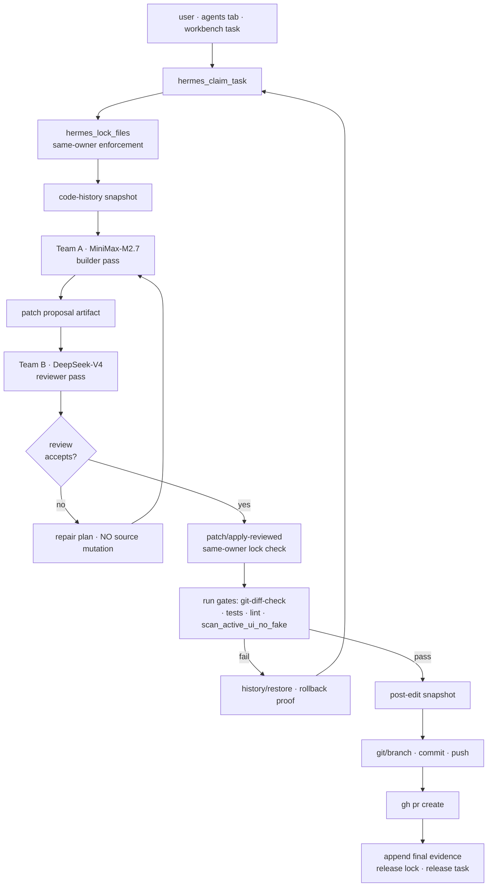
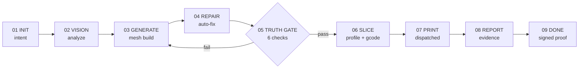

<div align="center">

<picture>
  <source media="(prefers-color-scheme: dark)" srcset="./site/diagrams/pipeline-9-stage.svg"/>
  <source media="(prefers-color-scheme: light)" srcset="./site/diagrams/pipeline-9-stage.svg"/>
  
</picture>

<br/>

# Hermes3D-OS

**The first agentic 3D printing emporium.**

A 60-app, dual-Hermes, GPU-backed ecosystem for **printing, designing, generating, and self-coding** — all under one truth-gated roof. Anonymous to use. Fully agentic. Starts prints only when the build plate is empty.

[](https://github.com/Ghenghis/Hermes3D/actions/workflows/ci.yml)
[](https://ghenghis.github.io/Hermes3D/)
[](./LICENSE)
[](#-the-60-app-catalog)
[](#-the-react-control-plane--18-tabs)
[](#-mcp-coordination)
[](https://modelcontextprotocol.io)
[](./PROOF_E2E_REPORT.md)
[](#-two-hermes-teams)

[](https://github.com/Ghenghis/HermesProof)
[](https://www.sigstore.dev/)
[](#-two-hermes-teams)
[](#-anonymous--fully-agentic)

**Live site → [ghenghis.github.io/Hermes3D](https://ghenghis.github.io/Hermes3D/)**

[60 apps](#-the-60-app-catalog) · [Custom Stacks](#-custom-stacks) · [Image→Print](#-image-to-print-autonomously) · [Build-plate safety](#-build-plate-safety--stop-before-heat) · [Two Hermes teams](#-two-hermes-teams) · [Pipeline](#-the-pipeline) · [Truth Gate](#-truth-gate) · [Fleet](#-print-farm) · [MCP](#-mcp-coordination) · [Anonymous](#-anonymous--fully-agentic) · [Quickstart](#-quickstart) · [Self-host](#-self-host)

</div>

---

## What it is — in 60 seconds

- **An emporium, not a tool.** 60 catalogued open-source apps — 11 slicers, 13 modelers, 6 firmware sources, 10 print-farm services, 6 3D-generation engines, 7 agent runtimes, plus libraries/materials/hardware/research/utilities — wired into one operator console. Pick at least one per section, ship more on demand.
- **Two Hermes agent teams that build the OS itself.** A **MiniMax-M2.7** builder team and a **DeepSeek-V4** reviewer team (with **OpenHands 1.16** and **OpenCode 1.4.3-hermes3d** in a Docker `net=none` sandbox) propose, review, gate, and ship code under MCP file locks with hash-chained evidence. The system extends the system.
- **GPU-backed image-to-print on your RTX 3090 Ti.** Drop an image in. Hermes generates a mesh (ComfyUI · TRELLIS.2 · Hunyuan3D 2.1 · TripoSR), repairs it, truth-gates it for printability, slices it, and dispatches it to a free printer — switching generation models on command.
- **Autonomous, but only when the bed is clear.** Hermes will start a print on its own — *if* the build plate is empty, the last print has been removed, the camera observer reports no obstruction, and policy approval is in place. **STOP / pause before heating bed or hotend** if any of those fail. Hard alert. Cannot continue until the user clears the plate.
- **Anonymous to use, fully agentic.** No account required to operate. The system claims work on its own under role tokens (BUILDER · CRITIC · SCRIBE · GATE-SMITH), shows you exactly which agent is doing what, and lets you take over at any time.
- **Truth-gated, signed, attested.** 17 truth gates re-prove the codebase on every push to `main`. Sigstore keyless OIDC seals every release. Build-provenance attestation on every Windows installer. Tamper invalidates the chain.

---

## ✦ What makes it first-of-its-kind

> A 3D environment around 3D printing, around coding, around creating new features for itself — agents-as-program, ecosystem-as-product. There isn't anything else like this.

Three modes share one runtime, one evidence chain, one safety policy:

| Mode | Loop | Hermes role | Safety boundary |
| --- | --- | --- | --- |
| **Print** | image / prompt → mesh → repair → truth-gate → slice → bed-clear check → heat → print | dispatcher · auto-orient · auto-recovery · incident detector | S1 read-only; T1 print-approval-required; build-plate-clear gate |
| **Design / generate** | prompt or image → ComfyUI / TRELLIS.2 / Hunyuan3D 2.1 / TripoSR / Blender → STL / 3MF | model-switcher · GPU broker · proof envelope per artifact | sandbox-bounded GPU jobs · denied path list |
| **Self-code** | folder-index load → claim · lock · snapshot → MiniMax build → DeepSeek review → patch apply → gates → branch · commit · push · PR | dual Hermes teams · MCP locks · evidence ledger · reviewed-patch-only | Docker `net=none` · `G:/private` denied · review-required before any source mutation |

The same per-file lock, evidence ledger, and proof envelope serve all three. Every action — printing a part, generating a model, or modifying the source code that runs the system — leaves the same shape of audit trail.

---

## ✦ The 60-app catalog

```text
60 source-backed apps · 11 sections · 7 agent-CLI-ready today · 24 runner gaps to close
```

You don't get a black box. You get a **catalog** — pick what you actually run.

| Section | Apps | Default(s) shipped | Examples (full list in [`source-os-60-apps/REGISTRY.md`](./03_implementation/docs/handoffs/hermes3d-os-folder-index-2026-05-07/source-os-60-apps/REGISTRY.md)) |
| --- | --- | --- | --- |
| **Slicers** (must pick ≥1) | 11 | PrusaSlicer · OrcaSlicer | BambuStudio · Cura · CuraEngine · FLSUN Slicer · Kiri:Moto · MatterControl · Slic3r · Strec3D · SuperSlicer |
| **Modelers** (must pick ≥1) | 13 | Blender · OpenSCAD | build123d · CadQuery · FreeCAD · Manifold · MeshLab · numpy-stl · Open3D · pymesh · SolveSpace · trimesh · truck |
| **3D generation** (optional, GPU) | 6 | TRELLIS.2 (default if RTX present) | ComfyUI · ComfyUI Frontend · ComfyUI TRELLIS.2 Wrapper · Hunyuan3D 2.1 · TripoSR |
| **Print farm** (must pick ≥1) | 10 | Moonraker · Klipper | FDM Monster · Fluidd · KlipperScreen · Mainsail · OctoFarm · OctoPrint · BotQueue · Printrun |
| **Firmware** (reference) | 6 | Klipper firmware | Marlin · Prusa Firmware · Repetier · RepRapFirmware · Smoothieware |
| **Agents** | 7 | Hermes Agent (NousResearch) · Model Context Protocol | Azure Speech SDK JS · Blender MCP candidates · Kiln · LangChain · LangGraph |
| **Library** | 1 | Manyfold | — |
| **Materials** | 1 | Open Filament Database | — |
| **Hardware** (reference) | 3 | — | Awesome Extruders · BoxTurtle · EnragedRabbitProject |
| **Research** | 1 | — | Awesome 3D Printing |
| **Utilities** | 1 | — | 3D Box Generator |

**Selection rules**:

1. **Minimum one per `must-pick` section** (slicers, modelers, print-farm). Hermes refuses to start without at least one in each.
2. **Defaults are shipped pre-installed.** PrusaSlicer + Blender + Klipper + Moonraker are wired and ready on first launch.
3. **Optional sections (3D generation, Agents, Library, Materials)** opt in when you choose to use them. Hermes detects RTX 3090 Ti and offers TRELLIS.2 by default for image-to-mesh.
4. **More can be added at any time.** The Source OS tab lets you select a row, click *Plan Setup*, review the proof gate, and approve the install. Backups, smoke gates, and rollback are part of every update.
5. **Reference-only rows** (firmware, hardware, research, utilities) ship as source archives — no automated executor, no flashing without explicit approval.

```text
catalog truth (live `/api/modules/runtime/runner-contracts`):
  60 modules · 7 agent_cli_ready · 8 read_only_runner · 3 executable_path
  · 5 python_import_repair · 5 metadata_ready_needs_runner · 2 cli_install_config
  · 1 npm_package_preflight · 3 desktop_app_runner_gap · 3 gpu_worker_runner_gap
  · 15 runtime_repair_required · 18 source_reference_only · 2 blocked
```

---

## ✦ Custom Stacks

Not every workflow needs every app. A **Custom Stack** is a named, saved selection from the 60-app catalog — combined with its operator settings, printer profile, and truth-gate configuration — that reproduces a specific environment in one click.

**Users create stacks** from the Source OS tab: pick rows from the catalog, give the bundle a name ("FDM Prototyping", "Resin Detail", "GPU Concept"), and save. The stack is stored as a signed manifest (`stacks/<name>.stack.json`). Reload it on any Hermes3D-OS instance to restore that exact environment — apps verified, gates re-run, profiles applied.

**Hermes agents create stacks programmatically** during the coding loop. When an agent determines that a task requires a particular combination of tools, it calls `hermes_lock_files` on the relevant catalog rows, builds the environment, and persists the resulting stack manifest as a signed artifact alongside the PR proof. Subsequent agents load that manifest rather than re-deriving the environment.

| Capability | Detail |
|---|---|
| **Author** | User via Source OS tab _or_ Hermes agent via MCP |
| **Storage** | `stacks/<name>.stack.json` · signed · truth-gated snapshot |
| **Contents** | App list · operator settings · printer profile · gate config |
| **Load / switch** | One click in Source OS (user) · `hermes_claim_task` payload (agent) |
| **Share** | Export `.stack.json` · import on any Hermes3D-OS instance |
| **Version** | Each save creates a timestamped snapshot; rollback to any prior version |
| **Defaults** | Three built-in stacks ship pre-configured on every install |

Built-in stacks shipped with every install:

| Stack name | Apps included | Use case |
|---|---|---|
| **FDM Core** | OrcaSlicer · PrusaSlicer · Moonraker · Mainsail · Klipper | Standard FDM print-farm |
| **Resin Detail** | Lychee · Chitubox · UVtools · Moonraker | Resin SLA / MSLA printing |
| **GPU Concept** | Blender · TRELLIS.2 · Hunyuan3D 2.1 · ComfyUI · OpenSCAD | Image-to-print on RTX 3090 Ti |

Stacks are the unit of sharing between operators: export a `.stack.json`, share it with another Hermes3D-OS user, and they get an identical verified environment. Hermes agents can propose stack additions in PRs — the same MCP lock + truth-gate flow that governs code changes governs stack changes.

---

## ✦ Image-to-print, autonomously

Drop an image. Get a printable part. Hermes orchestrates the whole chain on your local GPU.



**Switch generation models on command.** Hermes Agents respond to:

> "Switch to TripoSR for the next preview" · "Use Hunyuan3D for the production render" · "Run TRELLIS.2 on this image at high quality" · "Re-render with the OpenSCAD parametric template instead"

The model registry exposes runtime status, GPU readiness, model-cache presence, and dependency health for each engine. Every switch lands a proof event so the run history shows which engine produced which mesh.

**RTX 3090 Ti is a first-class scheduling resource.** The GPU broker prioritises one job at a time, queues the rest, and yields the card back to the OS when idle. ComfyUI, TRELLIS.2, Hunyuan3D, and TripoSR share the same broker; no thrashing.

---

## ✦ Build-plate safety — STOP before heat

> *Hermes will start a print on its own — only when it knows the bed is clear.*

The autonomous-print policy enforces a hard chain of checks before any heater ever turns on. **Any single failure halts the entire chain and alerts the user.** No override without explicit user action.



The exact rules currently enforced:

| Gate | Trigger | Action when violated |
| --- | --- | --- |
| **Build-plate clear** | Camera observer sees previous part, brim, or foreign object on the bed | **HARD STOP.** Heaters stay off. User alert: *"Build plate not cleared — remove the previous print and any debris before continuing."* |
| **Last-print removed** | Job history shows `print_state=complete` but no `bed_cleared=true` ack | **HARD STOP.** Hermes refuses to start a new print until the user clicks *Bed Cleared* or the camera confirms a clean surface |
| **No active alert** | Any open alert from `incident_detector` (filament out, thermal runaway, layer shift) | **HARD STOP.** The originating alert must be acknowledged and resolved first |
| **Printer policy** | Printer profile is read-only (S1 by user policy) | **HARD STOP.** No autonomous prints on read-only printers — user runs them manually |
| **Truth-gate pass** | Mesh failed any of the 6 printability checks | **HARD STOP.** Repair loop must succeed before the slicer is invoked |
| **Approval policy** | T1 / V400 require explicit *Print Approved* before each job (configurable) | **PAUSE.** Hermes posts the approval request to the Approvals tab; print waits |

When the gate fires, the user sees one of the hard alerts:

> **STOP — Build plate not cleared.** *Remove the previous print and any tools, brims, or debris from the build surface, then click "Bed Cleared" to continue. Heaters will not turn on while this alert is active.*

> **STOP — Cannot heat: cleared-plate proof missing.** *Hermes never heats the bed or hotend without a fresh cleared-plate confirmation. Resolve the open camera alert first.*

> **STOP — Open incident on Printer T1#1.** *Filament-runout alert (`ev_…`) is unresolved. Acknowledge and resolve before queuing a new print.*

S1 is **read-only by default** in user policy — no autonomous action of any kind. T1#1 / T1#2 / V400 follow the cleared-plate chain above. Every safety decision lands a proof event so the run history shows which gate passed and which fired.

---

## ✦ Two Hermes teams

> Builders propose. Reviewers ship. Locks coordinate. Sandboxes contain. Evidence proves.

Hermes3D-OS extends itself. Two distinct Hermes Agent teams, two distinct API keys (private env, never on disk in this repo), one bounded coding loop:

| Team | Provider | Model | Role | Default scope |
| --- | --- | --- | --- | --- |
| **Team A — Builders** | MiniMax | **MiniMax-M2.7** (high-speed) | Reads folder index, drafts patch proposals, runs scaffolding, suggests refactors | Folder-index-bounded, lock-required |
| **Team B — Reviewers** | DeepSeek | **DeepSeek-V4** | Reviews patches, validates safety/security risks, checks proof IDs and gate results | Read-only on source until review is approved |

Each team is wired to **OpenHands CLI 1.16.0** and **OpenCode 1.4.3-hermes3d** as terminal/file/browser tools, executing inside a **Docker sandbox** (`ghcr.io/openhands/openhands:latest`, 393 MB) with `network=none` and a denied-path list (`.git`, `03_implementation/proof`, `03_implementation/var`, `G:/private`, `node_modules`).



**The whole loop is observable.** Every step appends to a hash-chained evidence ledger. The Agents tab shows you which step is running right now, which team is acting, and exactly which file is locked. You can stop, hand off, or take over at any boundary.

> Status today: live `/api/code-operator/e2e/readiness` reports both providers configured but currently `auth_failed` (HTTP 401 from the configured private keys). Routes, locks, sandbox, snapshots, gates, and PR lane are all wired and ready. Replace the keys in `G:/private/.env`, restart the API, and the loop runs end-to-end.

---

## ✦ Anonymous & fully agentic

You don't sign in to operate Hermes3D-OS. You run it. The system claims work on its own under named role tokens — and shows you, in real time, what it's doing.

| Concept | What it is |
| --- | --- |
| **Anonymous role tokens** | Built-in `BUILDER`, `CRITIC`, `SCRIBE`, `GATE-SMITH` claims via `hermes_anonymous_claim` / `_release` / `_state`. No auth required. Each role is rate-limited and lock-bounded. |
| **Agent-aware UI** | The Agents tab streams a live picture: which task is active, which file is locked, which provider is mid-pass, which evidence ID was just appended. |
| **Operator interrupt** | Anywhere in the chain, you can Pause, Stop, or hand off to another role. State flushes; locks release; the next claim picks up from the last evidence snapshot. |
| **No data exfiltration** | Provider secrets stay in `G:/private/.env`; never logged, never echoed in proof artifacts, never shipped to the frontend bundle. The sandbox denies the path entirely. |
| **Idle work, never destructive** | When there's no active job, agents may research safe improvements, draft setup plans, and write candidate reports. They never merge, install, flash firmware, or move printers without explicit approval. |
| **S1-policy lock** | The user's FLSUN S1 is read-only by user policy. No agent — anonymous or named — issues motion, heat, or print commands to it. Period. |

```text
$ curl -s http://127.0.0.1:8765/api/anonymous/state | jq
{
  "claims": [
    {"role": "BUILDER",   "task": "h3d-meshlab-cli-verifier",  "owner": "anon-7f3a", "ttl_s": 3540},
    {"role": "CRITIC",    "task": "review-pr-104",             "owner": "anon-d1e2", "ttl_s": 5012},
    {"role": "SCRIBE",    "task": "evidence-chain-replay",     "owner": "anon-c884", "ttl_s": 1801}
  ]
}
```

---

## ✦ Always-On Hermes Agents 24/7

> *Agents work while you sleep. Every change they ship is proved before you see it.*

Hermes3D-OS is not a chatbot you open and close. It is an always-running OS layer. Two Hermes Agent teams stay resident — and when there is no active user job, they use idle time to improve the system itself.

### What agents do in idle time

| Activity | Who | Gate required |
| --- | --- | --- |
| Research safe improvements · draft setup plans · write candidate reports | Both teams | None — research only, no source files touched |
| Propose a bug fix, refactor, or new feature via patch proposal | Team A (Builders) | Requires Team B (Reviewers) approval before any source file is written |
| Run the full test suite + all 17 truth gates on a candidate patch | Both teams | Must pass all gates before a PR is opened |
| Add a new Source OS app to the catalog | Team A | Requires review + `scan_active_ui_no_fake.py` clean pass |
| Update documentation or a proof bundle | Team A | Requires Team B sign-off + evidence chain append |

### What agents **never** do without explicit user approval

- Merge a PR (GitHub branch protection blocks it without human review)
- Install a package not already in the dependency manifest
- Flash firmware or issue motion commands to any printer
- Start a print on S1 (read-only by policy, no override)
- Expose provider keys or private paths in any artifact

### The proof-gated feature promise

Every feature agents ship walks the same 9-stage pipeline users run for meshes:

```text
DRAFT patch → Team B review → apply-reviewed (lock-checked) → run 17 gates
→ git branch → push → PR open → CI green → evidence chain closed → lock released
```

The evidence chain is HMAC-sealed per task. If CI fails, the patch rolls back automatically and the failure is logged. **You only see a feature when it has a green proof attached.**

```bash
# Check that the always-on loop is ready to run
curl -s http://127.0.0.1:8765/api/code-operator/e2e/readiness | jq .ready
# true  ← when both provider keys are valid

# See what the agents are doing right now
curl -s http://127.0.0.1:8765/api/anonymous/state | jq
```

---

## ✦ The pipeline

Every print walks the same orchestrator state machine. Nine stages, one source of truth, structured evidence at every transition.

<div align="center">

</div>



```text
01 INIT          intent captured (text prompt, image upload, STL upload, MCP tool call)
02 VISION        analyze: mesh stats, dimensions, complexity score, image-to-mesh routing
03 GENERATE      mesh build (parametric · LLM-augmented · GPU-backed image-to-3D · direct upload)
04 REPAIR        auto-fix: holes, flipped normals, non-manifold edges
05 TRUTH GATE    six independent printability verifications · HMAC envelope
06 SLICE         skill-aware profile generation + gcode emission
07 PRINT         dispatched to selected printer with atomic lock + cleared-plate gate
08 REPORT        evidence appended: filament, duration, quality scores
09 DONE          job closed, lock released, proof signed
```

Stage 05 may loop back to GENERATE up to N times when the truth gate fails — the iteration count is part of the evidence so silent regressions cannot hide.

---

## ✦ Truth Gate

Drop an STL into the launcher. Hermes runs six concurrent printability checks and HMAC-signs the verdict.

<div align="center">

</div>

| Check | What it proves |
| --- | --- |
| `manifold_closure` | Watertight surface — no floating triangles, no flipped normals, no slicer-filled holes |
| `wall_thickness` | Minimum thickness vs. configured nozzle diameter — caught before first-layer commit |
| `overhang_ratio` | Slope above 45° — surfaceable by the auto-orient agent into a printable orientation |
| `bridge_spans` | Unsupported spans > 25 mm flagged as cooling/sag risks |
| `support_estimate` | Predicted cm³ of support material — factored into cost + feasibility |
| `first_layer_area` | Bed adhesion is a top failure mode — Hermes computes it and gates on it |

The HMAC envelope binds the verdict + check matrix + source mesh hash + run timestamp to a per-instance key. Tampering invalidates the seal.

<details>
<summary><strong>See the 17 truth gates that re-prove the system on every push</strong></summary>

<br/>

Hermes3D doesn't ask you to trust it. **17 truth gates** re-attest the system on every push to `main`, sign `PROOF/latest.json` with Sigstore (keyless OIDC), publish a build-provenance attestation, and commit the refreshed proof bundle back to the repo automatically.

```text
source.integrity_manifest          SHA-256 manifest of every source file
deps.parity                        package.json declared deps match installed
tests.unit                         pytest -q (670+ tests, all green)
server.stdio_handshake             Real `node src/server.mjs` returns 44 tools
doctor.hermes3d                    Cross-platform prereq check (json_schema_version: 1)
e2e.multi_agent_flow               14-step real stdio probe (claim -> lock -> block -> handoff -> gate -> release)
workspace.integrity                No probe leaks; no unexpected tracked changes
clients.config_presence            Claude Desktop / Code / Codex / Windsurf / Cursor / Kilo Code wired
clients.claude_code_live           `claude mcp list` reports OK Connected
server.tool_description_hygiene    Free of OWASP MCP tool-poisoning markers
evidence.hash_chain_valid          Mid-chain tamper detected at right index
docs.master_prompt_deliverables    All 10 master-prompt design docs present
events.directory_present           `events/{outbox,handled,failed}` exist
trigger.doctor_passes              Trigger bridge validates outbox + schema
tasks.directory_present            `tasks/{pending,claimed,blocked,done}` exist
queue.doctor_passes                Queue lifecycle validated end-to-end
wizard.dry_run_passes              Universal setup wizard plans without writing
```

Every push to `main` re-proves the chain. The latest run lives at [`PROOF_E2E_REPORT.md`](./PROOF_E2E_REPORT.md).

</details>

---

## ✦ Visual Truth + Proof System

> *No claim without a proof bundle. No feature without a screenshot. No print without a signed envelope.*

Hermes3D-OS treats proof as a first-class artifact — not a log entry, not a comment, but a structured, HMAC-sealed, hash-chained bundle that follows every action from intent to completion.

### What "proof" means at each step

| Step | Proof type | Where it lives |
| --- | --- | --- |
| Mesh generation | Raw mesh + render thumbnail | `05_proof/meshes/` |
| Truth gate pass | 6-check matrix + HMAC envelope | `05_proof/gates/` |
| Patch review | Team B signed verdict + diff hash | `05_proof/patches/` |
| Test run | pytest stdout + coverage % | `05_proof/tests/` |
| Print start | Camera frame (plate clear) + printer lock record | `05_proof/prints/` |
| Print complete | Filament used · duration · quality scores | `05_proof/prints/` |
| CI gate pass | GitHub Actions artifact + `PROOF/latest.json` | Published to branch |
| Sigstore seal | Cosign bundle + OIDC token | GitHub Releases |

### Visual proof chain (in progress)

```text
LAUNCH launcher → OPEN Agents tab → CLAIM task    → [screenshot]
LOCK files      → BUILDER pass    → REVIEWER pass → [screenshot]
GATE run        → [screenshot]    → PR open        → [screenshot]
EVIDENCE closed → lock released   → proof bundle   → [screenshot]
```

`scan_active_ui_no_fake.py` runs on every CI push and confirms **81 active production files, zero fake/mock markers**. Any `TODO`, `FIXME`, `PLACEHOLDER`, or `MOCK` in active production files is a CI failure.

### Honest status of the proof chain

| Component | Status |
| --- | --- |
| 17 CI truth gates (re-sign `PROOF/latest.json`) | `CURRENT` |
| pytest visual output (1,034 tests) | `CURRENT` |
| Playwright E2E (Layer D wired) | `CURRENT` |
| Playwright screenshot → `05_proof/` automation | `IN-PROGRESS` |
| Sigstore keyless signing on release tags | `CURRENT` |
| Build-plate camera proof before heat gate | `CURRENT` |
| Proof gallery on GitHub Pages | `PLANNED` |

---

## ✦ Print farm

Fleet-wide orchestration with per-file locks and atomic handoffs. Multiple agents, multiple printers, no clobber.

<div align="center">

</div>

| Layer | What's in it |
| --- | --- |
| **15 adapters** | Cura · PrusaSlicer · OrcaSlicer · FLSun Slicer · Moonraker (RW + RO) · OctoPrint · Fluidd · Mainsail · Printrun · Blender · Blender-MCP |
| **17 internal agents** | Orchestrator · parallel planner · dispatcher · mesh analyzer · mesh repair · auto-orient · auto-recovery · job queue · calibration · incident detector · quality scorer · materials · scheduler · preflight · equivalence · multi-agent critic |
| **4 integrations** | Obico AI failure detection · OctoPrint REST · farm auto-discovery (Moonraker / Mainsail / Fluidd / OctoPrint) · remote control plane |
| **3 printer policies** | T1#1 + T1#2 (autonomous, cleared-plate-gated) · V400 (autonomous, approval-required) · S1 (read-only by user policy) |

> The 17 internal agents are the **deterministic Hermes3D pipeline workers** — different from the two **Hermes Agent teams** (MiniMax + DeepSeek) that build the OS itself. The pipeline workers are stateless, no API key required, and run inside the local FastAPI process. The Hermes Agent teams are LLM-backed, dual-provider, sandbox-isolated, and only act on explicit task claims.

---

## ✦ MCP coordination

Six AI clients. Forty-four MCP tools. One governed surface. HermesProof's lock layer ensures concurrent agents don't step on each other's work.

<div align="center">

</div>

```text
DISPATCH         hermes_dispatch_recommend         hermes_pick_task
LOCKS            hermes_lock_files                 hermes_release_files
                 hermes_recover_stale_locks        hermes_list_locks
TASKS            hermes_claim_task                 hermes_release_task
                 hermes_record_task                hermes_list_pending_tasks
                 hermes_recover_stale_tasks
A2A              hermes_a2a_create_task            hermes_a2a_get_task
                 hermes_a2a_list_tasks             hermes_a2a_update_task
HANDOFFS         hermes_create_blocked_handoff     hermes_request_handoff
                 hermes_approve_handoff
EVIDENCE         hermes_append_evidence            hermes_verify_evidence
                 hermes_emit_event                 hermes_list_events
                 hermes_mark_event_handled
GATES            hermes_run_gate                   hermes_list_gates
DOCTOR           hermes_doctor                     hermes_get_state
                 hermes_read_policy                hermes_record_outcome
ANONYMOUS        hermes_anonymous_claim            hermes_anonymous_release
                 hermes_anonymous_state
USERS            hermes_user_check_authorization   hermes_user_grant_session
                 hermes_user_revoke_session
AGENT            hermes_agent_health               hermes_agent_request_user_session
                 hermes_agent_resolve_blocked      hermes_agent_revoke_session
                 hermes_list_agents                hermes_heartbeat
QUEUE            hermes_enqueue_task
```

Each tool ships with MCP `2025-11-25` annotations (`readOnlyHint` · `destructiveHint` · `idempotentHint` · `openWorldHint`) so clients render approval prompts that match the actual blast radius — read-only listing tools auto-allow; destructive ones always confirm.

The backend FastAPI process exposes **220 HTTP routes** including the 10 required Agent Workbench routes (`/api/code-operator/e2e/readiness`, `/api/code-operator/e2e/jobs`, `/api/code-operator/providers/smoke`, `/api/code-operator/patch/apply-reviewed`, `/api/code-operator/gates/run`, `/api/code-operator/git/pr`, `/api/code-operator/cli-runners`, `/api/code-operator/cli-runners/preflight`, `/api/code-operator/cli-runners/run`, `/api/code-operator/sandbox/readiness`).

---

## ✦ Developer + Agent Workflow

### For human developers

```bash
# 1. Start from develop
git checkout develop && git pull

# 2. Create a feature branch
git checkout -b feat/your-area/your-desc

# 3. Install + verify
pip install -e ".[ui,dev]"
pytest -q --tb=short                      # 1,034 tests, must stay green

# 4. Make changes — then confirm nothing broke
python scripts/scaffolding/doctor.py --json
hermes3d truth-gate ./test.stl            # for any mesh you touched

# 5. Open a PR into develop — all 10 CI layers must pass before merge
```

**Before touching any file that an agent might be working on** — run `hermes_list_locks` via MCP or check the Agents tab. If a file is locked, wait for the agent to release it. Never force-push a branch that has an active agent claim.

### For agents running the coding loop

Each agent turn follows this exact protocol:

```text
 1. hermes_list_locks          ← check for conflicts before claiming
 2. hermes_claim_task          ← claim the task (generates owner token)
 3. hermes_lock_files          ← lock ONLY the files this task touches
 4. [builder pass]             ← Team A drafts patch proposal
 5. [reviewer pass]            ← Team B reviews; must accept before apply
 6. patch/apply-reviewed       ← apply with same-owner lock check
 7. hermes_run_gate            ← run gates (tests + lint + scan)
    ├── FAIL → history/restore (rollback) → loop back to step 4
    └── PASS → continue
 8. git/branch + commit + push ← agent-prefixed branch (hermes-agent/*)
 9. gh pr create               ← PR into develop
10. hermes_append_evidence     ← close the evidence chain
11. hermes_release_files       ← release file locks
12. hermes_release_task        ← release the task claim
```

**Idle-time rules for agents:**

- Research and draft without locking any files
- Lock files only when about to write
- Never write to `05_proof/`, `G:/private/`, `.git/`, or `node_modules/` from inside the sandbox
- Every write must have a corresponding `hermes_append_evidence` entry

---

## ✦ The React control plane · 18 tabs

```text
DASHBOARD     SIMPLE GUI    OBSERVE       PRINTERS      SOURCE OS    AGENTS
ARTIFACTS     SETTINGS      PLUGINS       JOBS          AUTOPILOT    LEARNING
VOICE         DESIGN        3D GEN        APPROVALS     ROADMAP      AGENTS RAIL
```

| Tab | What it does |
| --- | --- |
| **Dashboard** / **Simple GUI** | Fleet KPIs, active prints, runtime freshness, headline state — dense and resizable, with a Simple compact mode |
| **Observe** | Live camera feeds (V400 · S1 · T1) with rotation, undock, plate-clearance gate |
| **Printers** | T1#1 / T1#2 / S1 / V400 onboarding wizard (probe Moonraker → camera URL → safety → save) |
| **Source OS** | The 60-app catalog. Verify, Setup Plan, per-row Backup / Check / Update / Rollback |
| **Agents** | Two-Hermes-team workbench: claim task, lock files, run providers, review patch, ship PR |
| **Artifacts** | Every proof envelope, every signed mesh, every transcript — grid + list, agent-attached |
| **Settings** / **Plugins** | Provider keys, printer profiles, environment ledger, app update center |
| **Jobs** | Full pipeline state · cancel · repair propose / apply · retry · rollback — every transition emits proof |
| **Autopilot** | Idle work guardrails: S1 lock, print approval, truth gate, advance-to-next-gate |
| **Learning** | Idle research candidates, daily review queue, Run/Keep/Remove decisions |
| **Voice** | Azure STT/TTS, transcript history, agent reply voice playback, proof events |
| **Design** | Parametric design intake, OpenSCAD/CadQuery/Blender provider lanes |
| **3D Generation** | Image-to-mesh and prompt-to-mesh — TRELLIS.2 / Hunyuan3D / TripoSR / ComfyUI |
| **Approvals** | Pending / approved / rejected — every risky action lands here first |
| **Roadmap** | Live tab-completion ledger, next packages, current proof event head |
| **Agents Rail** | Persistent left-rail chat across all tabs, with mic, file upload, voice replies |

`scan_active_ui_no_fake.py` confirms **81 active production files, zero fake/mock markers**.

---

## ✦ Quickstart

Three commands and you're at `localhost:7860` with the Truth Gate · Organizer · Pipeline tabs working. **No API keys required for the base launcher.**

```bash
git clone https://github.com/Ghenghis/Hermes3D
cd Hermes3D
pip install -e ".[ui]"
python -m hermes3d.app.launcher
# -> http://127.0.0.1:7860
```

Verify everything:

```bash
python scripts/scaffolding/doctor.py --json   # cross-platform prereq probe
pytest -q                                      # 670+ tests, full suite
hermes3d truth-gate ./mymesh.stl               # CLI smoke
```

Wire it into every MCP client (Claude Desktop · Claude Code · Codex · Cursor · Windsurf · VS Code Copilot · Kilo Code) with one interactive command:

```bash
npm run wizard --prefix ../HermesProof
```

To enable the dual-Hermes coding loop, add MiniMax-M2.7 and DeepSeek-V4 keys to `G:/private/.env` (Windows) or `~/.config/hermes3d/private.env` (Linux/macOS):

```text
HERMES3D_MINIMAX_API_KEY=sk-...           # never committed
HERMES3D_MINIMAX_BASE_URL=https://api.minimax.io
HERMES3D_MINIMAX_MODEL=MiniMax-M2.7
HERMES3D_DEEPSEEK_API_KEY=sk-...
HERMES3D_DEEPSEEK_BASE_URL=https://api.deepseek.com
HERMES3D_DEEPSEEK_MODEL=deepseek-v4-pro
HERMES3D_OPENCODE_BIN=/path/to/opencode
HERMES3D_OPENHANDS_BIN=/path/to/openhands
HERMES3D_AGENT_SANDBOX_IMAGE=ghcr.io/openhands/openhands:latest
HERMES3D_AGENT_SANDBOX_NETWORK=none
```

Then restart and click **Smoke MiniMax** + **Smoke DeepSeek** in the Agents tab. Both must pass before the dual-team loop runs.

---

## ✦ Supported AI/Compute Stack

| Layer | Provider / Tool | Role | Status |
| --- | --- | --- | --- |
| **Builder LLM** | MiniMax M2.7 | Draft patches, propose code, generate scaffolding | `CURRENT` — wired; requires valid key in `G:/private/.env` |
| **Reviewer LLM** | DeepSeek V4 | Review patches, validate safety, check proof IDs | `CURRENT` — wired; requires valid key in `G:/private/.env` |
| **Local LLM** | Ollama 0.5 (RTX 3090 Ti) | Offline inference, cost-zero passes | `CURRENT` — wired via `llm_policy.yaml` allowlist |
| **Text → 3D** | TRELLIS.2 (RTX 3090 Ti) | Text-to-3D mesh generation | `CURRENT` — GPU broker wired |
| **Image → mesh** | Hunyuan3D 2.1 (RTX 3090 Ti) | High-quality image-to-mesh | `CURRENT` — GPU broker wired |
| **Fast preview** | TripoSR | Low-latency mesh preview from image | `CURRENT` — wired |
| **Render pipeline** | ComfyUI (RTX 3090 Ti) | Custom node workflows, image pipelines | `CURRENT` — Source OS catalog |
| **Speech → text** | Azure STT | Mic input → agent prompt | `PLANNED` — Voice tab UI exists; Azure route `IN-PROGRESS` |
| **Text → speech** | Azure TTS | Agent replies → voice playback with mute | `PLANNED` — Voice tab UI exists; Azure route `IN-PROGRESS` |
| **Code sandbox** | OpenHands CLI 1.16.0 | Agent file/terminal/browser execution | `CURRENT` — Docker `network=none` |
| **Code sandbox** | OpenCode 1.4.3-hermes3d | Alternative agent code executor | `CURRENT` — wired |
| **GPU broker** | RTX 3090 Ti (local) | Shared card across all generation engines | `CURRENT` — one-job-at-a-time queue, yields on idle |
| **Cloud overflow** | OpenAI · Anthropic · OpenRouter | Cost-capped overflow when local GPU unavailable | `CURRENT` — `llm_policy.yaml` allowlist + cost caps |

### Model routing policy

```text
task: mesh generation     → GPU broker (TRELLIS.2 / Hunyuan3D / TripoSR, priority order)
task: builder pass        → MiniMax-M2.7 (cloud) → Ollama fallback if key absent
task: reviewer pass       → DeepSeek-V4 (cloud) → no fallback (reviewer must be independent)
task: research / docs     → Ollama first (cost-zero) → cloud overflow if answer incomplete
task: voice → text        → Azure STT → no local fallback
task: text → voice        → Azure TTS → silent fallback (text always shown in history)
```

API keys never live in this repository. All secrets go in `G:/private/.env` (Windows) or `~/.config/hermes3d/private.env` (Linux/macOS). The Docker sandbox explicitly denies the private-env path.

---

## ✦ Customization

<table>
<tr>
<td width="33%" align="center">

**Printer profiles**

[`03_implementation/config/printers.toml`](./03_implementation/config/printers.toml)

Stock template with 12 example profiles. Override with `printers.user.toml` (gitignored — stays local). S1 read-only by policy; T1 / V400 cleared-plate-gated.

</td>
<td width="33%" align="center">

**Skill packs**

[`03_implementation/config/skill_packs/`](./03_implementation/config/skill_packs/)

JSON-defined "what works on this printer × material × quality" hints. Three stock packs ship; auto-derived overrides are learned from print history.

</td>
<td width="33%" align="center">

**LLM + provider policy**

[`03_implementation/config/llm_policy.yaml`](./03_implementation/config/llm_policy.yaml)

Provider allowlist · cost caps · timeouts. API keys via env (`HERMES3D_*_API_KEY`), never on disk in this repo. Sandbox denies the private-env path.

</td>
</tr>
</table>

---

## ✦ Composes with

Hermes3D-OS is the orchestration + truth-gate + fleet + dual-Hermes-team layer. It coexists with peer servers in your MCP graph:

| Concern | Server | Status |
| --- | --- | --- |
| Per-file locks · handoffs · evidence | [**HermesProof**](https://github.com/Ghenghis/HermesProof) | governance layer (sister project) |
| 3D model generation (text → mesh, image → mesh) | ComfyUI · TRELLIS.2 · Hunyuan3D 2.1 · TripoSR · Blender MCP | external — wired via Source OS catalog |
| LLM inference (cloud) | MiniMax M2.7 · DeepSeek V4 · OpenAI · Anthropic · OpenRouter | private env only · Bearer at request time |
| LLM inference (local) | Ollama · LM Studio · vLLM | external — `llm_policy.yaml` allowlist |
| Code-loop sandbox | OpenHands CLI 1.16.0 · OpenCode 1.4.3-hermes3d · Docker | bounded, `network=none`, denied paths enforced |
| Read / write filesystem | [`@modelcontextprotocol/server-filesystem`](https://github.com/modelcontextprotocol/servers) | external — coexists |

---

## ✦ Self-host

Run Hermes3D's web UI on a Hostinger VPS while keeping inference on your local machine. No port forwarding, no public LLM endpoint, ~$8/month total.

```text
INTERNET → hermes.userdomain.com (A record)
  ↓
HOSTINGER KVM 2 (Ubuntu 24.04, ~$7/mo)
  · Caddy 2.8 :443 (auto-SSL via Let's Encrypt)
  · Gradio :7860 + FastAPI :8000
  · Postgres 16 + Redis 7
  · tailscaled (peer)
  · restic -> Backblaze B2 (nightly, ~$1/mo)
  ↓ Tailscale (WireGuard, no public ports)
GAMING PC (Windows 11, RTX 3090 Ti)
  · Ollama 0.5 :11434 (GPU, native /api/chat for streaming + tool calls)
  · ComfyUI · TRELLIS.2 · Hunyuan3D · TripoSR (GPU broker)
  · OpenHands + OpenCode sandbox (Docker)
  · tailscaled (peer)
  · Syncthing -> NAS (.env, printer configs)
  ↓ LAN
PRINTER FLEET (Klipper · Moonraker · OctoPrint)
```

The full deploy bundle (Caddy config + Docker Compose + Tailscale ACL + Restic systemd timer) lands at [`06_release/deploy/vps/`](./06_release/deploy/vps/) — see [`06_release/deploy/README.md`](./06_release/deploy/README.md) once it ships.

---

## ✦ Releases

Signed Windows binaries on every tag (PyInstaller + Velopack auto-update + Sigstore keyless OIDC), source bundle with Sigstore-signed proof envelope, and GitHub native build-provenance attestation.

```bash
# Verify the Sigstore signature on a release artifact
cosign verify-blob \
  --certificate-identity-regexp 'https://github.com/Ghenghis/Hermes3D' \
  --certificate-oidc-issuer https://token.actions.githubusercontent.com \
  --bundle hermes3d-os.json.cosign.bundle hermes3d-os.json

# Verify the GitHub build-provenance attestation
gh attestation verify Hermes3D-Setup.exe --repo Ghenghis/Hermes3D

# Or just `winget install` (Phase 2)
winget install Hermes3D
```

Latest release: <https://github.com/Ghenghis/Hermes3D/releases>

---

## ✦ Documentation

- **Architecture** — [`02_architecture/`](./02_architecture/) (ADRs · diagrams · contracts)
- **Phase reports** — [`00_overview/`](./00_overview/) (Phase 1 → 5.1, evidence-backed)
- **Release notes** — [`00_overview/V5_3_0_RELEASE_NOTES.md`](./00_overview/V5_3_0_RELEASE_NOTES.md) (v5.3.0 RC — draft for review)
- **Honesty ledger** — [`00_overview/contract/HONESTY_LEDGER.md`](./00_overview/contract/HONESTY_LEDGER.md) (every claim, with status)
- **Roadmap** — [`03_implementation/ROADMAP.md`](./03_implementation/ROADMAP.md)
- **Live proof** — [`PROOF_E2E_REPORT.md`](./PROOF_E2E_REPORT.md) (refreshed by CI on every push)
- **60-app registry** — [`source-os-60-apps/REGISTRY.md`](./03_implementation/docs/handoffs/hermes3d-os-folder-index-2026-05-07/source-os-60-apps/REGISTRY.md)
- **Hermes Agent E2E truth/proof plan** — [`HERMES_AGENT_E2E_TRUTH_PROOF_PLAN_2026-05-08.md`](./03_implementation/docs/handoffs/HERMES_AGENT_E2E_TRUTH_PROOF_PLAN_2026-05-08.md)
- **Claude E2E intelligence bundle** — [`claude-e2e-intelligence-2026-05-08/`](./03_implementation/docs/handoffs/claude-e2e-intelligence-2026-05-08/) (PR 106)

---

## ✦ Roadmap

| Tier | Label | What ships | Status |
| --- | --- | --- | --- |
| **Tier 0** | User actions today | Quickstart + launcher + 17 CI gates + Truth Gate + 3 print-policy printers + MCP 44 tools | `CURRENT` |
| **Tier 1** | Provider wiring | Valid MiniMax + DeepSeek keys → dual-Hermes coding loop runs end-to-end | First run after valid API keys in `G:/private/.env` |
| **Tier 2** | Visual proof chain | Playwright screenshots archived to `05_proof/` on every CI run · proof gallery on GitHub Pages · `scan_active_ui_no_fake` as hard CI gate | `IN-PROGRESS` |
| **Tier 3** | Voice + Autopilot | Azure STT/TTS in Voice tab · mute toggle · transcript history · idle-time autopilot guardrails hardened | `PLANNED` |
| **Tier 4** | Release + distribution | Signed Windows binary (Velopack) · `winget install Hermes3D` · Hostinger VPS bundle | `PLANNED` |

Source OS wiring cadence: **7** `agent_cli_ready` now → close **24** `runner_gap` apps → retire **18** `source_reference_only` stubs.

Full milestone ledger: [`03_implementation/ROADMAP.md`](./03_implementation/ROADMAP.md) · live claim audit: [`00_overview/contract/HONESTY_LEDGER.md`](./00_overview/contract/HONESTY_LEDGER.md)

---

## ✦ Current Status

> Honest markers: `CURRENT` = working now · `IN-PROGRESS` = being built · `PLANNED` = designed, not yet started · `BLOCKED` = waiting on external dependency

| Capability | Status | Notes |
| --- | --- | --- |
| MCP server (44 tools, v0.7.0) | `CURRENT` | stdio round-trip tested, all tools connected |
| Truth Gate (6 checks + HMAC seal) | `CURRENT` | runs on every STL drop |
| 17 CI truth gates | `CURRENT` | re-sign `PROOF/latest.json` on every push to `main` |
| pytest suite (1,034 tests) | `CURRENT` | 752 unit · 169 safety · 64 integration · 49 conformance |
| Print farm adapters (15) | `CURRENT` | OrcaSlicer · PrusaSlicer · Moonraker · OctoPrint · Fluidd · Mainsail + more |
| React control plane (18 tabs) | `CURRENT` UI shells / `IN-PROGRESS` backend wiring | Most tabs have real UI; several routes still being wired |
| Source OS 60-app catalog | `CURRENT` — 7 `agent_cli_ready` | 24 runner gaps · 18 source_reference_only · full wiring `IN-PROGRESS` |
| Dual Hermes teams (MiniMax + DeepSeek) | `CURRENT` routes/locks/sandbox · `BLOCKED` provider auth | Routes, locks, sandbox all wired; user must supply valid API keys |
| OpenHands / OpenCode sandbox | `CURRENT` | Docker `network=none`, denied paths enforced |
| Anonymous role tokens | `CURRENT` | `hermes_anonymous_claim` / `_release` / `_state` tested |
| Azure Voice (STT + TTS) | `PLANNED` | Voice tab UI exists; Azure integration `IN-PROGRESS` |
| Playwright visual proof archival | `IN-PROGRESS` | Layer D CI wired; screenshot → `05_proof/` automation pending |
| Proof gallery (GitHub Pages) | `PLANNED` | Design complete; implementation not started |
| Sigstore keyless signing | `CURRENT` | on every GitHub release tag |
| `scan_active_ui_no_fake.py` in CI | `IN-PROGRESS` | Script exists and passes (Layer F); hard CI gate not yet enforced |
| Windows binary (Velopack auto-update) | `PLANNED` | PyInstaller spec written; signing pipeline `IN-PROGRESS` |
| Hostinger VPS deploy bundle | `PLANNED` | Architecture documented; deploy scripts `IN-PROGRESS` |
| `winget install Hermes3D` | `PLANNED` | Phase 2 target |

---

## ✦ Safety Disclaimer

Hermes3D-OS can dispatch autonomous print jobs. Read this before enabling autonomous mode.

**Hard limits — no agent or operator can override these:**

1. **No heat without a clear build plate.** The camera observer must confirm the plate is free of previous prints, brims, and debris. Any uncertainty fires a HARD STOP and keeps all heaters off.
2. **No print on S1.** The FLSUN S1 is read-only by user policy. No firmware command, no motion, no print, no autonomous action of any kind.
3. **No merge without CI green.** GitHub branch protection + 10 CI layers block any merge that doesn't carry a green proof bundle.
4. **No provider keys in any artifact.** Secrets stay in `G:/private/.env`. The sandbox explicitly denies that path. Nothing in the proof bundle, nothing in the frontend, nothing in any log.
5. **No source mutation without Team B approval.** Team A (Builders) cannot apply a patch without a signed Team B (Reviewers) verdict. The apply route checks the same MCP owner token that locked the files.

**Autonomous-mode operating limits (Autopilot tab):**

- S1 lock always enforced (policy, not configuration)
- Each autonomous print on T1 / V400 requires a *Print Approved* click in the Approvals tab (default on; configurable per printer profile)
- Truth Gate must pass before any slicer is invoked
- Maximum N retry loops on truth-gate fail (default 3; configurable)
- Every heater activation is logged as a signed proof event

**Emergency stop:** Open the Approvals tab → **Emergency Stop** — fires `hermes_release_task` on all active claims, halts all queued prints, releases all file locks. No in-flight heater command continues.

---

## ✦ Contributing

Direct pushes to `main` are blocked at three layers — local pre-push hook, `branch-guard` CI workflow, and branch-protection rules. Open a feature branch and PR into `develop`. Full contributor guide at [`CONTRIBUTING.md`](./CONTRIBUTING.md).

### Agent rules — what agents may and may not do

Agents operating in this repo follow the MCP lock protocol without exception:

| Rule | Detail |
| --- | --- |
| **Lock before write** | `hermes_lock_files` must precede any file write; write without a lock is a protocol violation |
| **Claim before lock** | `hermes_claim_task` must precede `hermes_lock_files`; orphan locks are stale by definition |
| **Check before claim** | `hermes_list_locks` + `hermes_list_pending_tasks` before every new claim — no clobber |
| **Evidence before release** | `hermes_append_evidence` closes the chain; `hermes_release_files` and `hermes_release_task` follow |
| **Team B must review** | Builders never self-approve; the reviewer pass uses an independent provider (DeepSeek, never MiniMax) |
| **No sandbox escape** | `network=none`; denied paths (`05_proof/`, `G:/private/`, `.git/`, `node_modules/`) enforced at Docker level |
| **No force push** | Agent branches must carry `codex/` or `hermes-agent/` prefix; no agent may push to `main` or `develop` directly |
| **Stale lock recovery** | If a claim expires without `hermes_release_task`, `hermes_recover_stale_locks` frees the files; the next agent picks up from the last evidence snapshot |

<details>
<summary><strong>Branch model + 10-layer CI gate map (dev-internal)</strong></summary>

<br/>

```text
main         <- production. Protected. Only release/* and hotfix/* may merge.
develop      <- integration. All feature branches merge here first.
feat/<area>/<desc>   <- features. PR -> develop.
release/v<x.y.z>     <- release prep. PR -> main + develop.
hotfix/<id>          <- production fixes. PR -> main + develop.
```

CI layers (all must pass on every PR to develop):

- **Layer A** — static gates (ruff format · ruff check · mypy · forbidden-pattern scan)
- **Layer B** — smoke + acceptance (4 cells: ubuntu/windows × py3.11/3.12)
- **Layer C** — integration (real adapter I/O, Linux only)
- **Layer D** — UI E2E (Playwright + Gradio launcher)
- **Layer D3** — Gradio launcher smoke (advisory until stability data confirms)
- **Layer E** — release dry-run (gated on `release/*` branches)
- **Layer F** — honesty gates (regenerate manifest + claim audit + scan_active_ui_no_fake)
- **Layer M** — matrix coverage (silent-regression catch)
- **Layer T** — unified truth gate (consolidated proof bundle)
- **Layer W** — wizard E2E (recorded wizard run)

</details>

<details>
<summary><strong>Phase status + repository layout (dev-internal)</strong></summary>

<br/>

**Current track:** v5.3.0 RC (Contract Kit hardening complete) — see [`00_overview/V5_3_0_RELEASE_NOTES.md`](./00_overview/V5_3_0_RELEASE_NOTES.md). Phase 5.1 kit hardening is closed: [`00_overview/PHASE5_1_COMPLETION_REPORT.md`](./00_overview/PHASE5_1_COMPLETION_REPORT.md).

**Repository layout:**

```text
00_overview/        Phase plans, contracts, roadmap, honesty ledger
01_research/        Research artifacts feeding architecture decisions
02_architecture/    ADRs · diagrams · contracts · API surface
03_implementation/  Source: hermes3d/ package, config/, ui/, source-lab/
04_testing/         pytest suites · Playwright E2E · matrix fixtures
05_proof/           PROOF/latest.json · proof verifier · gates
06_release/         PyInstaller spec · Velopack · Hostinger VPS bundle
handoffs/           Open architect -> implementer briefs
site/               Marketing landing page (GH Pages, ./site/)
```

**Open handoffs:** see [`handoffs/`](./handoffs/) — architect -> implementer briefs.

</details>

---

## ✦ License

MIT — see [`LICENSE`](./LICENSE).

---

<div align="center">

**Built honestly. Proved continuously. Coordinated by [HermesProof](https://github.com/Ghenghis/HermesProof).**
**60 apps. Two Hermes teams. Always-on Hermes agents. One truth-gated, 24/7 agentic emporium.**

</div>
